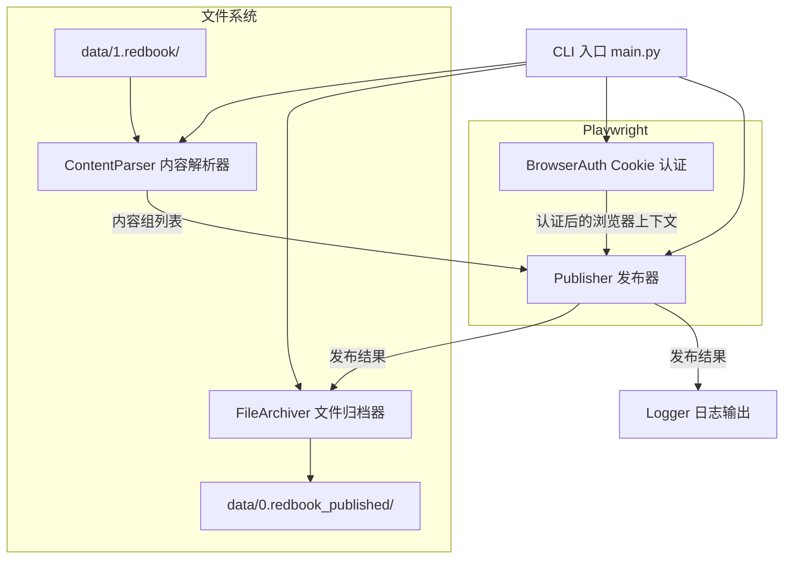

<!-- @AI_GENERATED -->
# 技术设计文档：小红书自动发布工具

## 概述

本工具是一个基于 Python + Playwright 的命令行自动化脚本，用于将本地 Markdown + 图片文件对自动发布到小红书创作者平台草稿箱。

核心流程：
1. 扫描 `data/1.redbook/` 目录，解析 Markdown + 图片内容组
2. 通过 Cookie 注入完成小红书创作者平台认证
3. 使用 Playwright 驱动浏览器，自动填写标题、正文、上传图片、添加话题标签
4. 点击"存草稿"保存到草稿箱
5. 成功后将文件归档到 `data/0.redbook_published/`

设计原则：
- 单一职责：每个模块只负责一件事（解析、认证、发布、归档）
- 容错优先：单篇失败不影响批量流程
- 可观测性：全程控制台日志输出进度和状态

## 架构



整体架构采用管道式设计：解析 → 认证 → 发布 → 归档，每个阶段独立可测试。

## 组件与接口

### 1. ContentParser（内容解析器）

负责扫描待发布目录、配对 Markdown 和图片文件、解析 Markdown 内容。

```python
@dataclass
class ContentPair:
    """一组待发布内容"""
    md_path: Path          # Markdown 文件路径
    image_path: Path       # 图片文件路径
    title: str             # 解析后的标题（已截断至20字符）
    body: str              # 正文内容（不含标题行）
    tags: list[str]        # 话题标签列表

class ContentParser:
    def __init__(self, pending_dir: Path):
        self.pending_dir = pending_dir
    
    def scan(self) -> list[ContentPair]:
        """扫描目录，返回按文件名排序的有效内容组列表"""
        ...
    
    def _find_image(self, md_path: Path) -> Path | None:
        """查找同名图片文件（.png/.jpg/.jpeg）"""
        ...
    
    def _parse_markdown(self, md_path: Path) -> tuple[str, str, list[str]]:
        """解析 Markdown 文件，返回 (标题, 正文, 标签列表)"""
        ...
    
    def _extract_title(self, first_heading: str) -> str:
        """提取标题，超过20字符自动截断"""
        ...
    
    def _extract_tags(self, content: str) -> list[str]:
        """从文件末尾提取 #标签名 格式的话题标签"""
        ...
```

### 2. BrowserAuth（Cookie 认证）

负责读取 Cookie 配置并注入到 Playwright 浏览器上下文。

```python
class BrowserAuth:
    def __init__(self, cookie_string: str):
        self.cookie_string = cookie_string
    
    @staticmethod
    def load_cookie() -> str:
        """从环境变量 XHS_COOKIE 或配置文件 .env 中读取 Cookie"""
        ...
    
    async def create_context(self, browser: Browser) -> BrowserContext:
        """创建注入 Cookie 的浏览器上下文"""
        ...
    
    async def verify_auth(self, context: BrowserContext) -> bool:
        """访问创作者平台验证认证是否有效"""
        ...
```

### 3. Publisher（发布器）

核心组件，驱动 Playwright 完成单篇发布到草稿箱的全流程。

```python
@dataclass
class PublishResult:
    """单篇发布结果"""
    content: ContentPair
    success: bool
    error: str | None = None

class Publisher:
    CREATOR_URL = "https://creator.xiaohongshu.com/publish/publish"
    
    def __init__(self, context: BrowserContext):
        self.context = context
    
    async def publish_one(self, content: ContentPair) -> PublishResult:
        """执行单篇发布到草稿箱的完整流程"""
        ...
    
    async def publish_batch(self, contents: list[ContentPair], batch_size: int = 5) -> list[PublishResult]:
        """批量发布，每次最多 batch_size 篇"""
        ...
    
    async def _upload_image(self, page: Page, image_path: Path) -> None:
        """上传图片"""
        ...
    
    async def _fill_title(self, page: Page, title: str) -> None:
        """填写标题"""
        ...
    
    async def _fill_body(self, page: Page, body: str) -> None:
        """填写正文"""
        ...
    
    async def _add_tags(self, page: Page, tags: list[str]) -> list[str]:
        """添加话题标签，返回未匹配的标签列表"""
        ...
    
    async def _save_draft(self, page: Page) -> None:
        """点击存草稿按钮"""
        ...
```

### 4. FileArchiver（文件归档器）

负责将已发布的文件从待发布目录移动到已发布目录。

```python
class FileArchiver:
    def __init__(self, pending_dir: Path, published_dir: Path):
        self.pending_dir = pending_dir
        self.published_dir = published_dir
    
    def archive(self, content: ContentPair) -> bool:
        """将内容组文件移动到已发布目录，返回是否成功"""
        ...
```

### 5. CLI 入口（main.py）

```python
async def main():
    """CLI 入口，支持 --batch 参数切换批量模式"""
    ...
```

## 数据模型

### ContentPair（内容组）

| 字段 | 类型 | 说明 |
|------|------|------|
| md_path | Path | Markdown 文件的绝对路径 |
| image_path | Path | 图片文件的绝对路径 |
| title | str | 解析后的标题，最长20字符 |
| body | str | 正文内容，不含标题行 |
| tags | list[str] | 话题标签列表，不含 # 前缀 |

### PublishResult（发布结果）

| 字段 | 类型 | 说明 |
|------|------|------|
| content | ContentPair | 对应的内容组 |
| success | bool | 是否发布成功 |
| error | str \| None | 失败时的错误信息 |

### BatchSummary（批量发布摘要）

| 字段 | 类型 | 说明 |
|------|------|------|
| total | int | 总处理数量 |
| success_count | int | 成功数量 |
| fail_count | int | 失败数量 |
| skip_count | int | 跳过数量（无图片配对等） |
| results | list[PublishResult] | 各篇发布结果详情 |

### Markdown 文件格式约定

基于对现有内容的分析，Markdown 文件遵循以下结构：

```markdown
# 📚 标题文本（emoji + 中文标题）

> 引用/副标题（可选）


正文内容...

---

#标签1 #标签2 #标签3
```

解析规则：
- 标题：第一个 `# ` 开头的行，去除 `# ` 前缀
- 正文：标题行之后的所有内容（含引用、图片引用、正文段落）
- 标签：`---` 分隔线之后，以 `#` 开头的连续文本，按空格分割

### Cookie 格式

Cookie 字符串格式为浏览器标准格式：
```
key1=value1; key2=value2; ...
```

存储位置（按优先级）：
1. 环境变量 `XHS_COOKIE`
2. 项目根目录 `.env` 文件中的 `XHS_COOKIE=...`


## 正确性属性

*属性（Property）是一种在系统所有有效执行中都应成立的特征或行为——本质上是对系统应做什么的形式化陈述。属性是人类可读规格说明与机器可验证正确性保证之间的桥梁。*

本功能中，内容解析、标题处理、标签提取、文件配对、批量选取和摘要统计等纯逻辑部分适合属性测试。浏览器自动化操作（Playwright 交互）部分使用集成测试覆盖。

### Property 1: Markdown 解析 round-trip

*For any* 包含 `# 标题` 行和正文内容的有效 Markdown 文本，解析出的标题（截断前原始文本）与正文拼接后，应能重构出原始内容（标题行 + 正文）。

**Validates: Requirements 1.4, 1.6**

### Property 2: 标题长度不变量

*For any* 任意长度的字符串作为标题输入，经过标题提取和截断处理后，输出标题的长度始终 ≤ 20 个字符，且输出是原始标题的前缀。

**Validates: Requirements 1.5**

### Property 3: 标签提取 round-trip

*For any* 随机生成的标签名列表，将其格式化为 `#标签1 #标签2 ...` 的标准格式后，提取函数应返回与原始标签列表一致的结果。

**Validates: Requirements 1.7**

### Property 4: 文件配对正确性

*For any* 给定的 Markdown 文件名和目录中的文件列表，配对函数应且仅应返回同名且扩展名为 .png/.jpg/.jpeg 的图片文件。当不存在匹配图片时，应返回 None。

**Validates: Requirements 1.2, 1.3**

### Property 5: 批量选取排序与截取

*For any* 随机生成的内容组列表（数量 0 到 N），批量选取函数返回的结果应满足：(a) 按文件名字典序排序，(b) 数量为 min(列表长度, batch_size)，(c) 是完整排序列表的前缀。

**Validates: Requirements 1.1, 5.1, 5.5**

### Property 6: 文件归档正确性

*For any* 随机文件名的内容组，归档操作后，文件应存在于已发布目录且不再存在于待发布目录。

**Validates: Requirements 4.1**

### Property 7: 摘要统计一致性

*For any* 随机生成的 PublishResult 列表（包含成功、失败、跳过的混合结果），摘要中的 success_count + fail_count + skip_count 应等于 total，且各计数与列表中对应状态的实际数量一致。

**Validates: Requirements 5.4**

## 错误处理

| 错误场景 | 处理策略 | 对应需求 |
|----------|----------|----------|
| Markdown 文件无对应图片 | 跳过该内容组，控制台输出提示 | 1.3 |
| Cookie 无效/过期 | 终止执行，输出明确错误信息 | 2.3 |
| 页面加载超时 | 记录错误，跳过当前内容组，继续下一组 | 3.8 |
| 元素定位失败 | 记录错误，跳过当前内容组，继续下一组 | 3.8 |
| 话题标签无法匹配 | 控制台提示用户手动添加，不阻断发布流程 | 3.6 |
| 文件移动失败 | 记录错误，保留原文件不删除 | 4.3 |
| 批量发布中单篇失败 | 记录失败信息，继续处理剩余内容组 | 5.3 |
| 待发布目录为空 | 输出提示信息，正常退出 | - |

错误处理原则：
- Cookie 认证失败是致命错误，立即终止
- 单篇发布失败是非致命错误，不影响批量流程
- 文件操作失败采用保守策略，宁可不移动也不丢失文件

## 测试策略

### 属性测试（Property-Based Testing）

使用 **Hypothesis**（Python PBT 库）实现属性测试，每个属性测试最少运行 100 次迭代。

测试标签格式：`Feature: redbook-auto-publish, Property {number}: {property_text}`

覆盖范围：
- ContentParser 的所有纯逻辑方法（标题提取、截断、正文提取、标签解析、文件配对）
- 批量选取逻辑（排序 + 截取）
- 摘要统计逻辑
- 文件归档逻辑（使用临时目录）

### 单元测试（Example-Based）

使用 **pytest** 编写，覆盖：
- Cookie 读取逻辑（mock 环境变量和文件）
- 批量发布容错（mock 发布函数注入失败）
- 日志输出格式验证
- 边界情况：空目录、标题恰好20字符、无标签的 Markdown 文件

### 集成测试

使用 **pytest + playwright** 编写，覆盖：
- Cookie 注入和认证验证
- 单篇发布完整流程（需要真实或 mock 的小红书创作者平台）
- 批量发布流程

集成测试建议在开发阶段使用 `headed` 模式（可视化浏览器）调试，CI 中可选跳过。

### 测试文件结构

```
tests/
├── test_content_parser.py      # ContentParser 属性测试 + 单元测试
├── test_file_archiver.py       # FileArchiver 属性测试 + 单元测试
├── test_batch_logic.py         # 批量选取和摘要统计属性测试
├── test_browser_auth.py        # Cookie 认证单元测试
└── test_publisher_integration.py  # Publisher 集成测试
```

<!-- @AI_GENERATED: end -->
