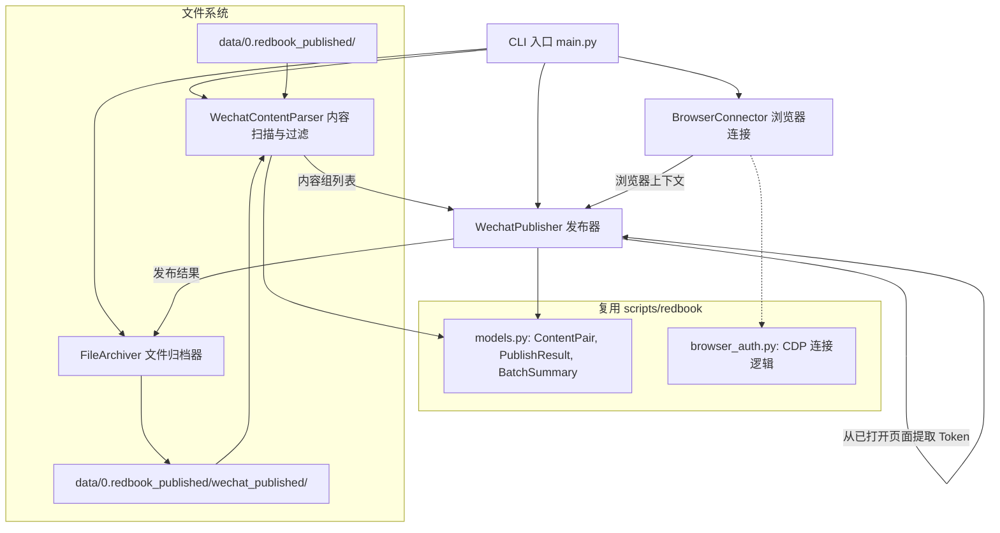

<!-- @AI_GENERATED -->
# 技术设计文档：微信公众号自动发布工具

## 概述

本工具基于已有的小红书自动发布工具（`scripts/redbook/`）架构，构建微信公众号自动发布工具。使用 Python + Playwright 浏览器自动化技术，将 `data/0.redbook_published/` 中已发布到小红书的内容（Markdown + 图片）批量保存为微信公众号草稿。

核心流程：
1. 扫描 `data/0.redbook_published/` 目录，排除 `wechat_published/` 子目录中已归档的内容
2. 通过 CDP 协议连接用户已登录微信公众号后台的 Chrome 浏览器
3. 从已打开的微信公众号后台页面 URL 中自动提取 token
4. 使用 Playwright 驱动浏览器，在编辑页面完成封面图上传、标题填写、正文填写
5. 点击"保存为草稿"按钮
6. 成功后将文件归档到 `data/0.redbook_published/wechat_published/`

设计原则：
- 最大化复用：复用小红书项目的数据模型（ContentPair, PublishResult, BatchSummary）和浏览器连接逻辑
- 单一职责：每个模块只负责一件事（内容扫描/过滤、Token 获取、发布、归档）
- 容错优先：单篇失败不影响批量流程
- 可观测性：全程控制台日志输出进度和状态

关键技术决策：
- 不使用 Cookie 注入方式认证，而是直接复用用户已登录的浏览器会话
- Token 从已打开的微信公众号后台页面 URL 中动态提取，无需手动配置
- 内容来源是小红书已发布目录（二次分发），不是原始待发布目录

## 架构



与小红书项目的主要差异：
- 内容来源不同：小红书从 `data/1.redbook/` 读取，微信从 `data/0.redbook_published/` 读取并排除已归档内容
- 认证方式不同：小红书使用 Cookie 注入，微信直接复用已登录的浏览器会话
- Token 机制：微信需要从已打开页面 URL 中提取 token 来构造编辑页面 URL
- 发布目标不同：小红书直接发布，微信保存为草稿
- 页面交互不同：微信公众号后台的 DOM 结构与小红书创作者平台完全不同

## 组件与接口

### 1. WechatContentParser（内容扫描与过滤）

负责扫描 `data/0.redbook_published/` 目录，配对 Markdown 和图片文件，排除已归档到微信的内容。复用小红书 `ContentParser` 的 Markdown 解析逻辑，但扫描和过滤逻辑不同。

```python
class WechatContentParser:
    def __init__(self, source_dir: Path, archive_dir: Path):
        self.source_dir = source_dir      # data/0.redbook_published/
        self.archive_dir = archive_dir    # data/0.redbook_published/wechat_published/
    
    def scan(self) -> list[ContentPair]:
        """扫描源目录，排除已归档内容，返回按文件名排序的有效内容组列表"""
        ...
    
    def _get_archived_stems(self) -> set[str]:
        """获取已归档目录中所有 Markdown 文件的 stem（不含扩展名）"""
        ...
    
    def _find_image(self, md_path: Path) -> Path | None:
        """查找同名图片文件（.png/.jpg/.jpeg）"""
        ...
    
    def _parse_markdown(self, md_path: Path) -> tuple[str, str, list[str]]:
        """解析 Markdown 文件，返回 (标题, 正文, 标签列表)"""
        ...
    
    def _extract_title(self, first_heading: str) -> str:
        """提取标题，超过20字符自动截断"""
        ...
```

### 2. BrowserConnector（浏览器连接）

通过 CDP 协议连接用户已打开的 Chrome 浏览器。复用 `scripts/redbook/browser_auth.py` 中的 CDP 连接逻辑，但不需要 Cookie 注入和认证验证。

```python
CDP_PORT = 9222
CDP_URL = f"http://localhost:{CDP_PORT}"

class BrowserConnector:
    async def connect(self, pw: Playwright) -> BrowserContext:
        """通过 CDP 连接已有 Chrome 浏览器，返回第一个 context"""
        ...
```

### 3. WechatPublisher（发布器）

核心组件，负责 Token 提取和驱动 Playwright 完成单篇发布到草稿箱的全流程。

```python
EDIT_PAGE_URL_TEMPLATE = (
    "https://mp.weixin.qq.com/cgi-bin/appmsg"
    "?t=media/appmsg_edit_v2&action=edit&isNew=1"
    "&type=77&createType=8&token={token}&lang=zh_CN"
)

class WechatPublisher:
    def __init__(self, context: BrowserContext):
        self.context = context
        self.token: str | None = None
    
    async def extract_token(self) -> str:
        """从已打开的微信公众号后台页面 URL 中提取 token 参数"""
        ...
    
    async def publish_one(self, content: ContentPair) -> PublishResult:
        """执行单篇发布到草稿箱的完整流程"""
        ...
    
    async def publish_batch(
        self, contents: list[ContentPair], batch_size: int = 5
    ) -> list[PublishResult]:
        """批量发布，每次最多 batch_size 篇"""
        ...
    
    async def _upload_cover(self, page: Page, image_path: Path) -> None:
        """上传封面图"""
        ...
    
    async def _fill_title(self, page: Page, title: str) -> None:
        """填写标题（placeholder 为"请在这里输入标题"）"""
        ...
    
    async def _fill_body(self, page: Page, body: str) -> None:
        """填写正文内容"""
        ...
    
    async def _save_draft(self, page: Page) -> None:
        """点击"保存为草稿"按钮"""
        ...
```

### 4. FileArchiver（文件归档器）

将成功保存为草稿的内容文件从 `data/0.redbook_published/` 移动到 `data/0.redbook_published/wechat_published/`。注意：这里是移动（不是复制），归档后源目录中不再有该文件。

直接复用 `scripts/redbook/file_archiver.py` 中的 `FileArchiver` 类，只需传入不同的目录参数。

```python
# 直接复用
from scripts.redbook.file_archiver import FileArchiver

archiver = FileArchiver(
    pending_dir=Path("data/0.redbook_published"),
    published_dir=Path("data/0.redbook_published/wechat_published"),
)
```

### 5. CLI 入口（main.py）

```python
async def main(argv: list[str] | None = None) -> None:
    """CLI 入口：扫描 → 连接浏览器 → 提取 Token → 批量发布 → 归档 → 输出摘要"""
    ...
```

## 数据模型

复用 `scripts/redbook/models.py` 中的数据模型，不新增模型定义。

### ContentPair（内容组）— 复用

| 字段 | 类型 | 说明 |
|------|------|------|
| md_path | Path | Markdown 文件路径 |
| image_path | Path | 图片文件路径 |
| title | str | 解析后的标题，最长20字符 |
| body | str | 正文内容，不含标题行 |
| tags | list[str] | 话题标签列表（微信发布流程中不使用，但保留兼容性） |

### PublishResult（发布结果）— 复用

| 字段 | 类型 | 说明 |
|------|------|------|
| content | ContentPair | 对应的内容组 |
| success | bool | 是否保存草稿成功 |
| error | str \| None | 失败时的错误信息 |

### BatchSummary（批量发布摘要）— 复用

| 字段 | 类型 | 说明 |
|------|------|------|
| total | int | 总处理数量 |
| success_count | int | 成功数量 |
| fail_count | int | 失败数量 |
| skip_count | int | 跳过数量 |
| results | list[PublishResult] | 各篇发布结果详情 |

### 微信公众号编辑页面 URL 格式

```
https://mp.weixin.qq.com/cgi-bin/appmsg?t=media/appmsg_edit_v2&action=edit&isNew=1&type=77&createType=8&token=TOKEN&lang=zh_CN
```

Token 从已打开的微信公众号后台页面 URL 中提取，URL 中的 `token=` 参数值即为所需 Token。


## 正确性属性

*属性（Property）是一种在系统所有有效执行中都应成立的特征或行为——本质上是对系统应做什么的形式化陈述。属性是人类可读规格说明与机器可验证正确性保证之间的桥梁。*

本功能中，内容扫描/过滤、Markdown 解析、标题处理、Token 提取/URL 构造等纯逻辑部分适合属性测试。浏览器自动化操作（Playwright 交互）部分使用集成测试覆盖。

### Property 1: 内容扫描正确性

*For any* 源目录中的 Markdown 文件集合和归档目录中的已归档文件集合，扫描结果应且仅应包含：(a) 在源目录中有同名图片文件（.png/.jpg/.jpeg）配对的 Markdown 文件，且 (b) 其文件名不在归档目录的已归档集合中。

**Validates: Requirements 1.1, 1.2, 1.3**

### Property 2: 扫描结果排序不变量

*For any* 扫描返回的内容组列表，列表中的元素应按 Markdown 文件名的字母顺序严格排序。

**Validates: Requirements 1.4**

### Property 3: 标题提取与截断不变量

*For any* 任意字符串作为 Markdown 标题输入，经过提取和截断处理后，输出标题的长度始终 ≤ 20 个字符，且输出是原始标题的前缀。

**Validates: Requirements 2.1, 2.2**

### Property 4: Markdown 解析 round-trip

*For any* 随机生成的标题、正文和标签列表，将其按照约定格式（`# 标题\n\n正文\n\n---\n\n#标签1 #标签2`）组装为 Markdown 文本后，解析函数提取出的正文应与原始正文一致（去除首尾空白后）。

**Validates: Requirements 2.3, 2.4**

### Property 5: Token 提取与 URL 构造 round-trip

*For any* 随机生成的数字字符串作为 token，使用该 token 构造编辑页面 URL 后，从该 URL 中提取 token 应返回原始 token 值。

**Validates: Requirements 4.1, 4.3**

## 错误处理

| 错误场景 | 处理策略 | 对应需求 |
|----------|----------|----------|
| Source_Dir 目录不存在 | 输出警告信息，返回空列表，正常退出 | 1.5 |
| Markdown 文件无对应图片 | 跳过该内容组，控制台输出提示 | 1.3 |
| CDP 连接失败 | 终止执行，输出包含 Chrome 调试模式启动命令的错误信息 | 3.2 |
| 未找到微信公众号后台页面 | 终止执行，提示用户先打开微信公众号后台 | 4.2 |
| Token 提取失败 | 终止执行，输出错误信息并以非零退出码退出 | 4.2, 8.4 |
| 编辑页面加载超时 | 记录错误，跳过当前内容组，继续下一组 | 5.7 |
| 封面图上传失败 | 记录错误，跳过当前内容组，继续下一组 | 5.7 |
| 标题/正文填写失败 | 记录错误，跳过当前内容组，继续下一组 | 5.7 |
| "保存为草稿"按钮点击失败 | 记录错误，跳过当前内容组，继续下一组 | 5.7 |
| 文件归档（移动）失败 | 记录错误，保留原文件不删除 | 7.3 |
| 批量发布中单篇失败 | 记录失败信息，继续处理剩余内容组 | 5.7, 6.2 |

错误处理原则：
- 浏览器连接失败和 Token 获取失败是致命错误，立即终止
- 单篇发布失败是非致命错误，不影响批量流程
- 文件操作失败采用保守策略，宁可不移动也不丢失文件

## 测试策略

### 属性测试（Property-Based Testing）

使用 **Hypothesis**（Python PBT 库）实现属性测试，每个属性测试最少运行 100 次迭代。

测试标签格式：`Feature: wechat-auto-publish, Property {number}: {property_text}`

覆盖范围：
- WechatContentParser 的扫描与过滤逻辑（文件配对、归档排除、排序）
- Markdown 解析纯逻辑（标题提取、截断、正文提取）
- Token 提取与 URL 构造的 round-trip

### 单元测试（Example-Based）

使用 **pytest** 编写，覆盖：
- 源目录不存在时返回空列表（需求 1.5）
- CDP 连接失败时的错误信息格式（需求 3.2）
- 未找到微信后台页面时的错误提示（需求 4.2）
- 发布异常时 PublishResult 包含错误信息（需求 5.7）
- CLI 参数解析：`--batch-size` 默认值和自定义值（需求 6.1, 8.2）
- 初始化失败时以非零退出码退出（需求 8.4）
- 批量发布摘要输出格式（需求 6.4）

### 集成测试

使用 **pytest + playwright** 编写，覆盖：
- CDP 浏览器连接（需求 3.1, 3.3）
- Token 提取完整流程（需求 4.1）
- 单篇发布完整流程：封面图上传 → 标题填写 → 正文填写 → 保存草稿（需求 5.1-5.6）
- 批量发布流程（需求 6.2）

集成测试需要真实的 Chrome 浏览器和已登录的微信公众号后台，建议在开发阶段使用 `headed` 模式调试，CI 中可选跳过。

### 测试文件结构

```
scripts/wechat/tests/
├── test_content_parser.py          # WechatContentParser 属性测试 + 单元测试
├── test_token.py                   # Token 提取与 URL 构造属性测试 + 单元测试
├── test_main.py                    # CLI 入口单元测试
└── test_publisher_integration.py   # Publisher 集成测试
```

<!-- @AI_GENERATED: end -->
