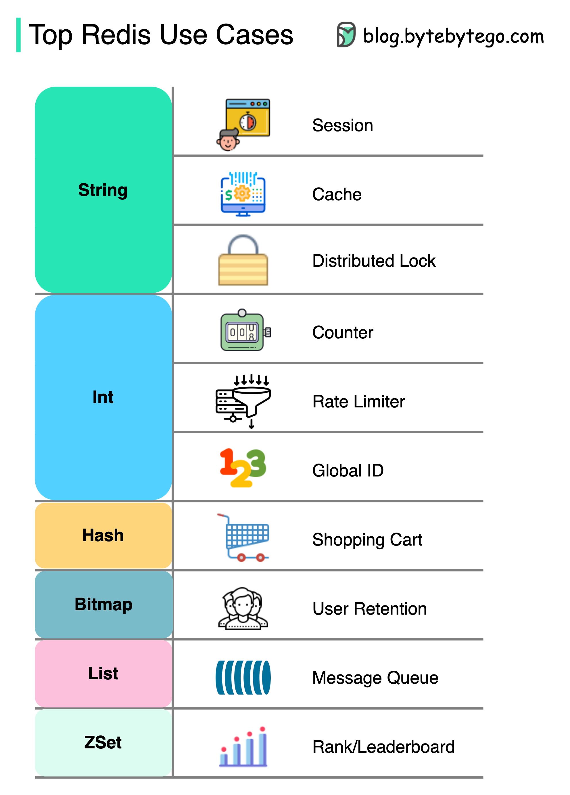

# 🔴 Redis的10种用法！不只是缓存

> Redis能做的事比你想象的多得多

Redis远不止缓存这一个用途 👇

📌 **Session** — 多服务间共享用户会话
📌 **缓存** — 缓存对象或页面，尤其是热点数据
📌 **分布式锁** — 用String实现分布式服务间的锁
📌 **计数器** — 统计点赞数、阅读量
📌 **限流器** — 对特定用户IP限流
📌 **全局ID生成器** — 用Int生成全局ID
📌 **购物车** — 用Hash表示购物车的键值对
📌 **用户留存计算** — 用Bitmap记录每日登录，计算留存率
📌 **消息队列** — 用List实现消息队列
📌 **排行榜** — 用ZSet对文章排序

💡 Redis的数据结构（String/Hash/List/Set/ZSet/Bitmap）决定了它的多样性。选对数据结构是用好Redis的关键。

---

#Redis #缓存 #后端开发 #程序员 #数据库 #技术干货
