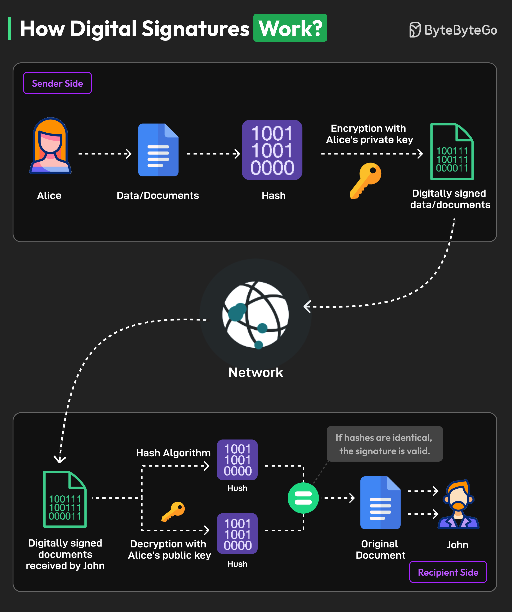

# ✍️ 数字签名是怎么工作的？完整流程解析

> 保证文档没被篡改，验证发送者身份

数字签名的完整工作流程，以Alice发送给John为例 👇

📌 **签名过程（Alice）**
1. 生成公钥和私钥对
2. 用哈希函数对文档生成哈希值
3. 用私钥加密哈希值 = 数字签名
4. 签名附加到原文档，发送给John

📌 **验证过程（John）**
5. 提取数字签名和原始哈希值
6. 用Alice的公钥解密数字签名，得到哈希值
7. 对收到的文档重新计算哈希值
8. 比较两个哈希值：相等=文档未被篡改

💡 数字签名解决两个问题：身份验证（确认是Alice发的）和完整性验证（确认内容没被改过）。

---

#数字签名 #加密 #安全 #程序员 #技术干货 #密码学
