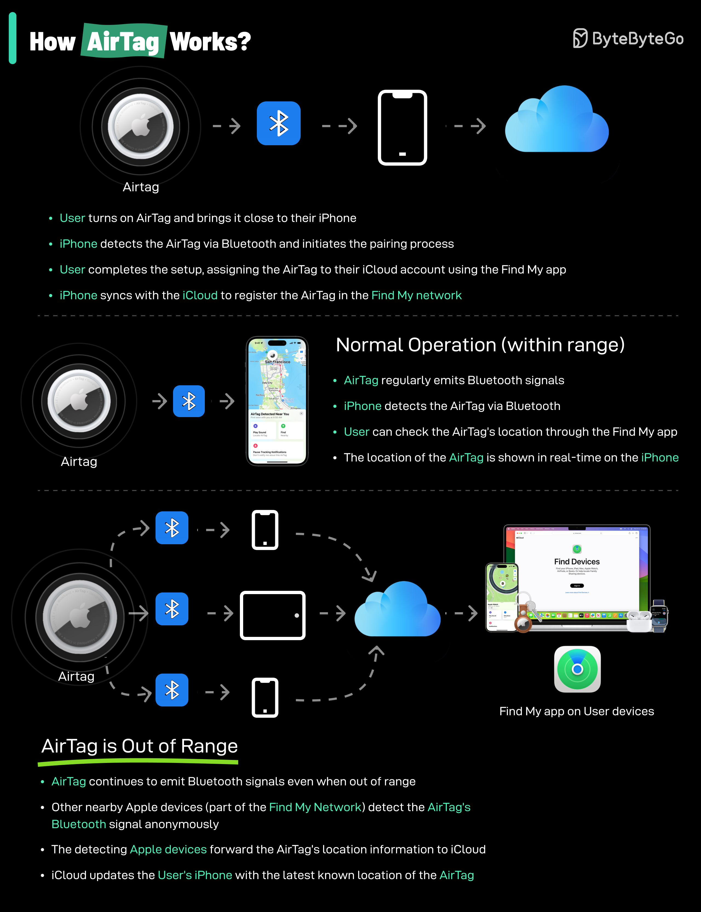

# 📍 AirTag是怎么工作的

> 利用全球数亿台苹果设备组成的网络来定位

AirTag利用蓝牙和苹果设备网络来帮你找到丢失的物品 👇

📌 **工作原理**
1. AirTag发出安全的蓝牙信号
2. 附近的苹果设备（iPhone、iPad等）检测到信号
3. 这些设备匿名安全地将AirTag位置信息中继到iCloud
4. 你在"查找"App中查看AirTag的大致位置

📌 **局限性**
依赖蓝牙和附近的苹果设备。如果AirTag在苹果设备稀少的区域，位置更新会不及时

💡 AirTag的巧妙之处：不需要GPS或蜂窝网络，利用全球数亿台苹果设备组成的众包网络来定位。

---

#AirTag #苹果 #蓝牙 #技术原理 #科技 #技术干货
