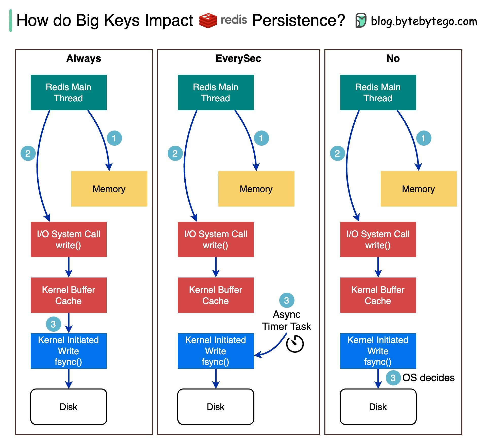

# 🔑 Redis大Key对持久化的影响

> 5MB的大Key可能让Redis主线程卡死

大Key（如5MB的数据）对Redis AOF持久化的影响，取决于模式 👇

📌 **Always模式**
每次数据更新同步写磁盘。更新大Key时主线程被阻塞，必须等写入完成。影响最大

📌 **EverySec模式**
后台定时任务每秒调用fsync()。大Key对主线程无影响。推荐使用

📌 **No模式**
Redis不控制写磁盘时机，交给操作系统。大Key对主线程无影响

🔑 **原理**
Redis先写内存 → 调用write()写入内核缓冲区 → fsync()刷盘。三种模式的区别在于fsync()的调用时机

💡 生产环境建议用EverySec模式，兼顾性能和数据安全。同时要避免大Key，拆分成小Key。

---

#Redis #持久化 #缓存 #后端开发 #程序员 #技术干货
