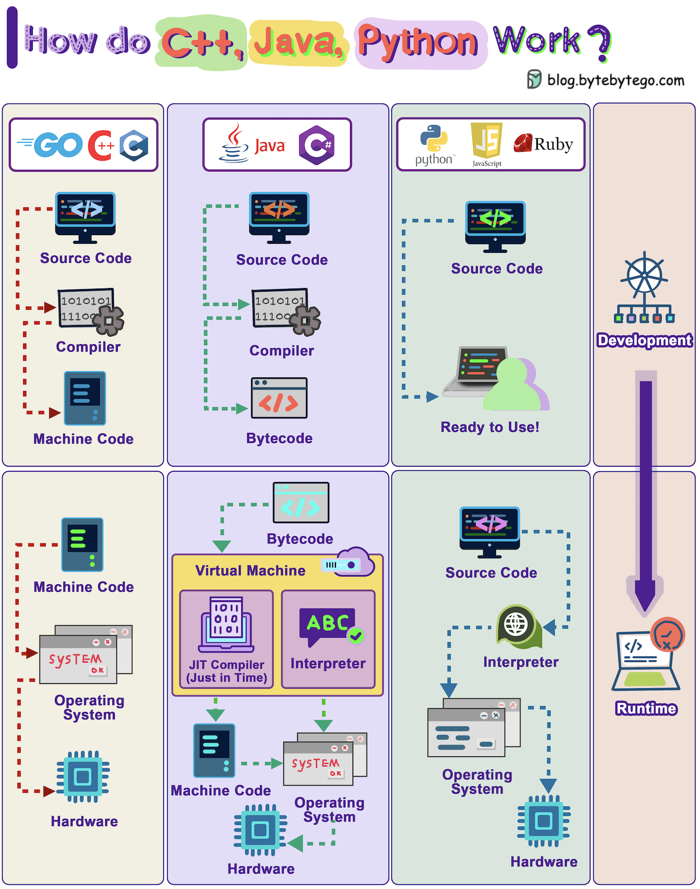

# ⚙️ C++、Java、

> 编译型、字节码型、解释型，各有千秋

三种编程语言的编译和执行方式 👇

📌 **编译型语言（C、C++、Go）**
源代码 → 编译器 → 机器码 → CPU直接执行
速度最快

📌 **字节码语言（Java、C#）**
源代码 → 编译器 → 字节码 → JVM执行
JIT编译器可以将热点代码编译成机器码加速

📌 **解释型语言（Python、JavaScript、Ruby）**
源代码 → 解释器运行时逐行解释执行
开发效率高但运行速度较慢

💡 一般来说：编译型 > 字节码型 > 解释型（运行速度）。但开发效率往往相反。选语言要看场景，不要只看速度。

---

#编程语言 #C++ #Java #Python #程序员 #计算机基础 #技术干货
