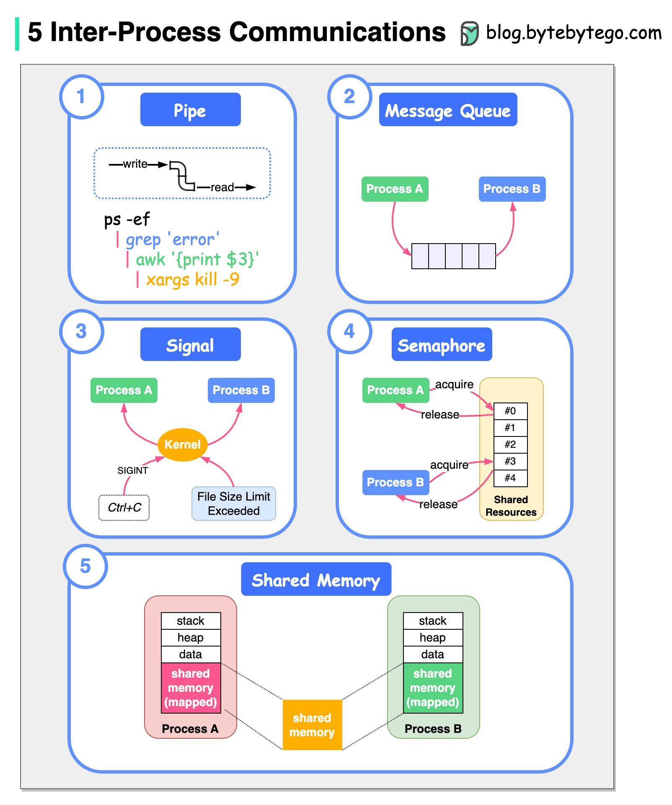

# 🐧 Linux进程间通信的5种方式！

> 进程之间怎么"说话"？5种IPC机制一次搞懂

Linux中进程间通信（IPC）的5种方式 👇

1️⃣ **管道（Pipe）** — 单向字节流，连接一个进程的标准输出到另一个的标准输入

2️⃣ **消息队列（Message Queue）** — 一个或多个进程写消息，一个或多个进程读消息

3️⃣ **信号（Signal）** — 最古老的IPC方式。键盘中断或错误条件可以产生信号（如Ctrl+C发送SIGINT）

4️⃣ **信号量（Semaphore）** — 内存中的值，多个进程可以测试和设置。用于进程同步

5️⃣ **共享内存（Shared Memory）** — 多个进程通过共享的虚拟地址空间通信。速度最快的IPC方式

💡 性能排序：共享内存 > 管道 > 消息队列 > 信号。选择哪种取决于通信模式和数据量。

---

#Linux #进程间通信 #操作系统 #程序员 #计算机基础 #技术干货
