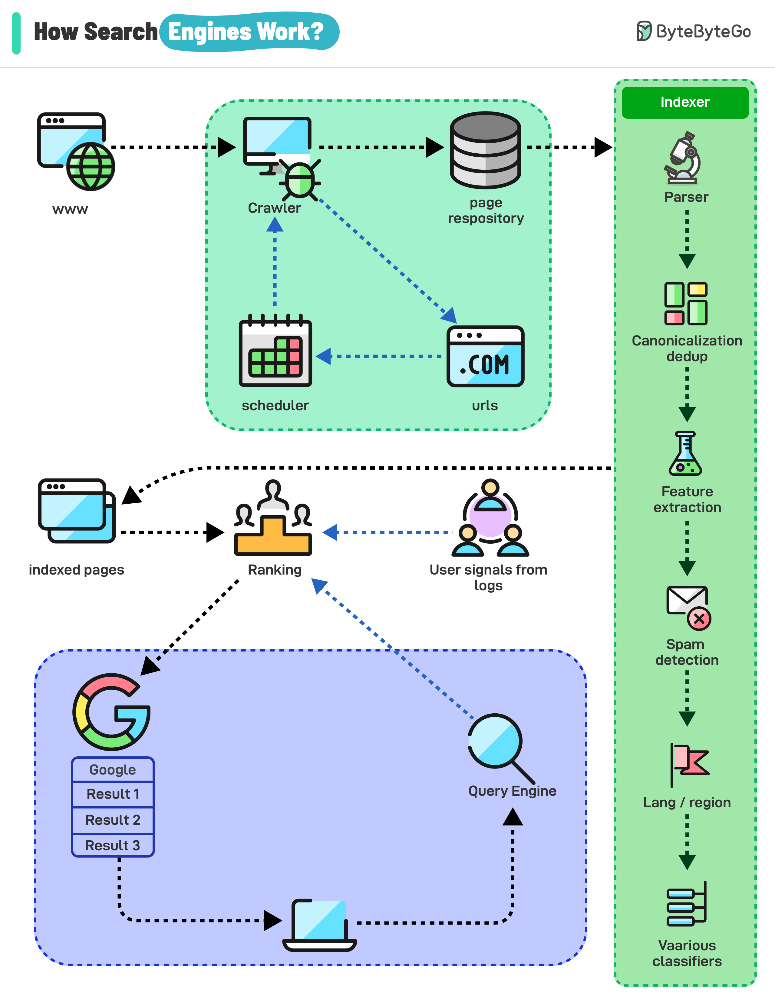

# 🔍 搜索引擎是怎么工作的？三大核心流程

> 爬取、索引、排序，搜索引擎的三板斧

搜索引擎通过三个核心流程工作 👇

1️⃣ **爬取（Crawling）**
爬虫从已知网页出发，沿着链接发现新页面，构建庞大的互联内容网络

2️⃣ **索引（Indexing）**
分析爬取的信息，提取关键词、内容类型、新鲜度、语言等，组织成巨大的索引数据库

3️⃣ **服务搜索结果（Serving）**
- 查询分析：理解用户意图，识别关键词和同义词
- 检索：从索引中匹配相关页面
- 排序：根据相关性和其他因素排名

💡 搜索引擎的核心竞争力在排序算法。Google的PageRank就是通过分析链接关系来判断页面重要性。

---

#搜索引擎 #Google #算法 #程序员 #技术干货 #SEO
