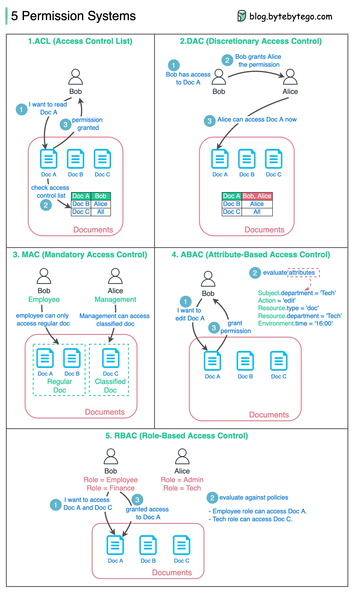

# 🔐 权限系统设计的5种方式

> 不同场景需要不同的权限模型

5种常见的权限控制方式 👇

1️⃣ **ACL（访问控制列表）** — 规则列表指定谁能访问什么资源。简单易懂，但维护成本高

2️⃣ **DAC（自主访问控制）** — 基于ACL，资源所有者决定访问策略。Linux文件系统就用这个。灵活但权限分散

3️⃣ **MAC（强制访问控制）** — 资源和用户都有分类标签，不同标签不同权限。严格但不灵活

4️⃣ **ABAC（基于属性的访问控制）** — 根据资源所有者、操作、资源、环境的属性评估权限。灵活但规则复杂

5️⃣ **RBAC（基于角色的访问控制）** — 根据角色评估权限。灵活且最常用

💡 大多数Web应用用RBAC就够了。需要更细粒度控制时考虑ABAC。

---

#权限系统 #RBAC #安全 #系统设计 #程序员 #后端开发 #技术干货
