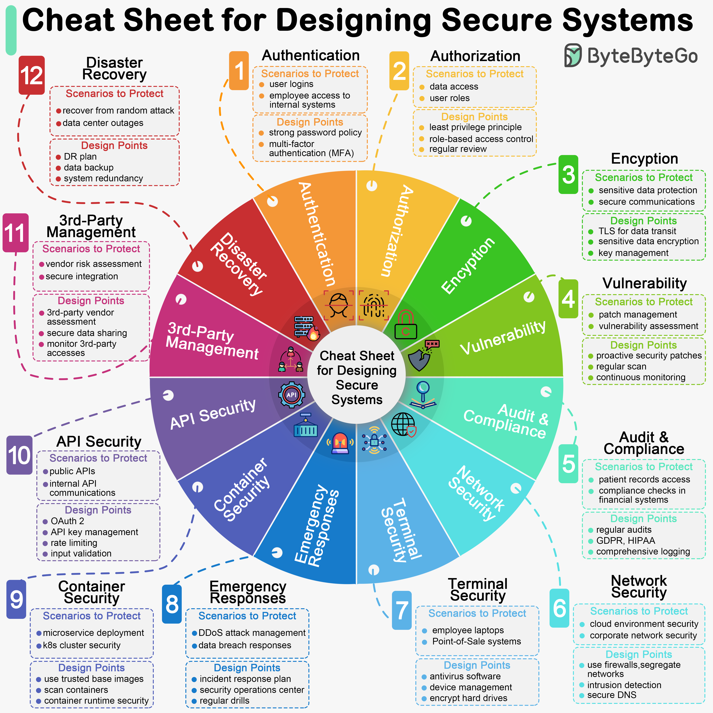

# 🛡️ 如何设计安全系统？12个关键设计点

> 安全不是事后补救，而是设计阶段就要考虑的

设计安全系统的12个关键维度 👇

📌 认证（Authentication）
📌 授权（Authorization）
📌 加密（Encryption）
📌 漏洞管理（Vulnerability）
📌 审计与合规（Audit & Compliance）
📌 网络安全（Network Security）
📌 终端安全（Terminal Security）
📌 应急响应（Emergency Responses）
📌 容器安全（Container Security）
📌 API安全（API Security）
📌 第三方供应商管理
📌 灾难恢复（Disaster Recovery）

💡 安全是每个开发者的责任，不只是安全团队的事。这12个维度应该成为系统设计的默认考量。

---

#安全 #系统设计 #网络安全 #程序员 #后端开发 #技术干货
