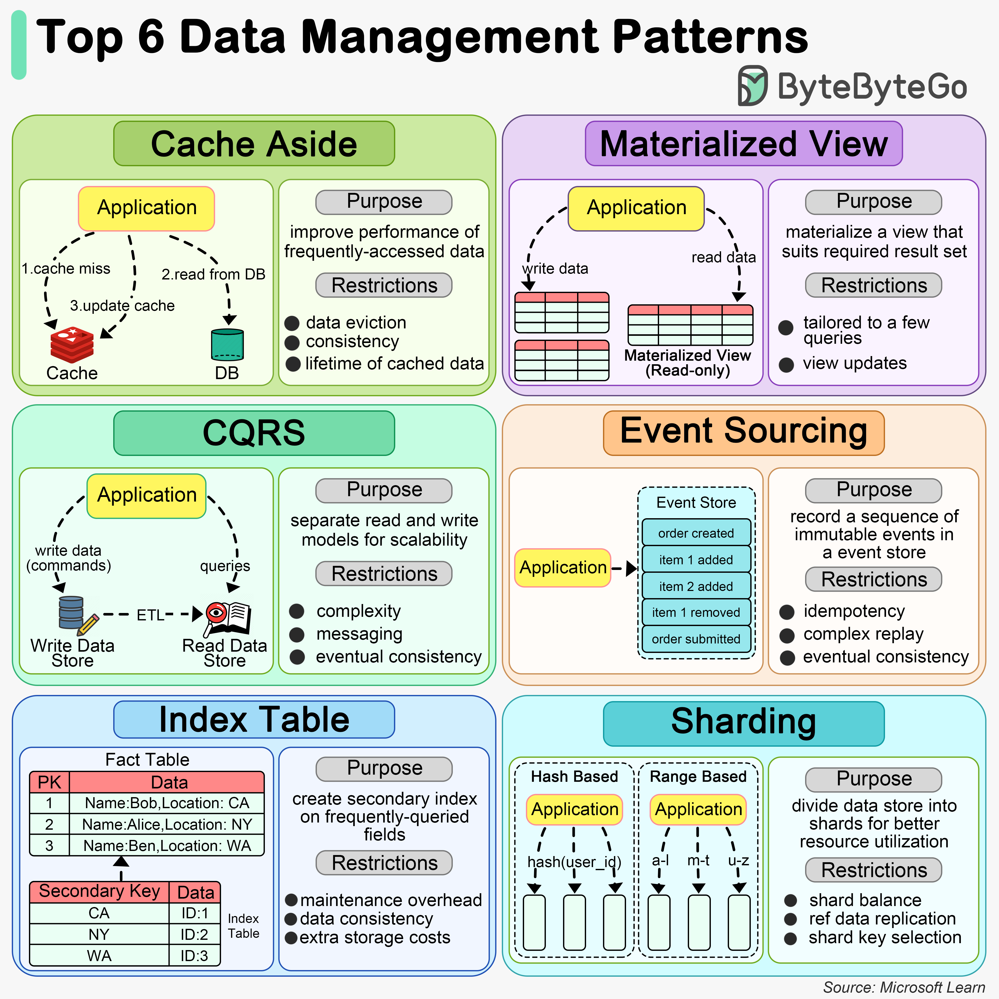

# 📊 6大数据管理模式

> 不同场景用不同的数据管理策略

6种最常用的数据管理模式 👇

1️⃣ **Cache Aside** — 先查缓存，没命中再查数据库并更新缓存。适合读多写少

2️⃣ **物化视图** — 预计算查询结果存储在磁盘上，加速复杂查询。适合数据仓库和BI

3️⃣ **CQRS** — 读写模型分离，各自独立优化。适合读写需求差异大的复杂系统

4️⃣ **事件溯源** — 存储事件序列而非当前状态，可重建历史状态。适合需要审计轨迹的场景

5️⃣ **索引表** — 创建额外的优化表作为二级索引，加速特定查询

6️⃣ **分片** — 数据分布到多台服务器，水平扩展。适合高流量应用

💡 这些模式可以组合使用，比如CQRS+事件溯源是经典搭配。

---

#数据管理 #CQRS #缓存 #系统设计 #程序员 #后端开发 #技术干货
