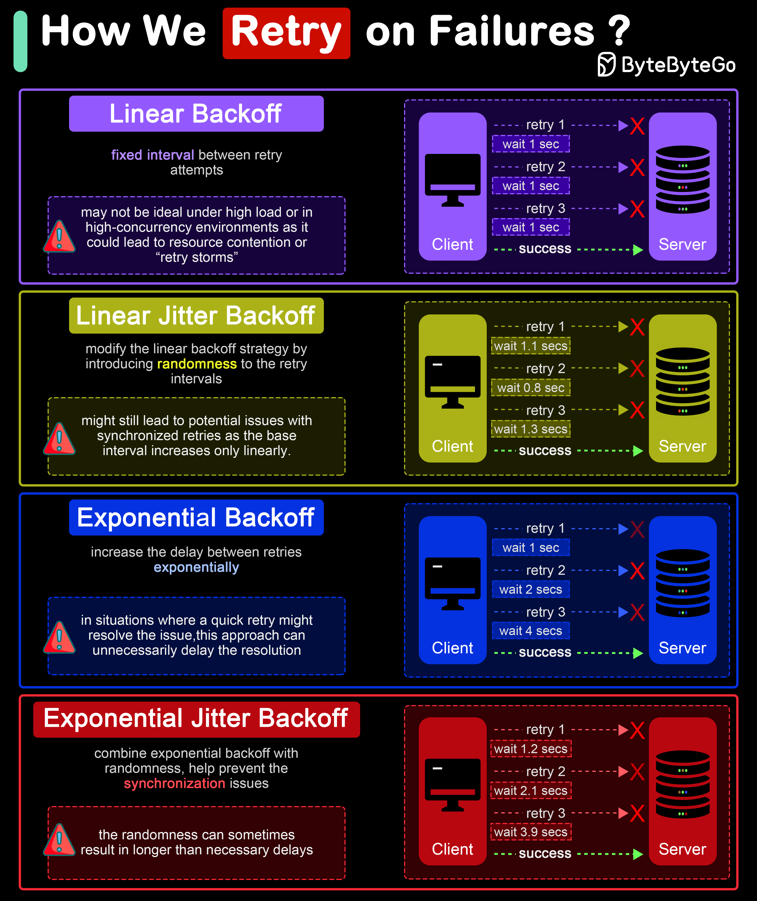

# 🔄 失败重试的4种策略！别让重试变成雪崩

> 重试策略选不好，可能比不重试还糟糕

分布式系统中4种常用的重试策略 👇

1️⃣ **线性退避** — 等待时间线性增长（1s→2s→3s）。简单但高并发时可能引发重试风暴

2️⃣ **线性抖动退避** — 线性增长+随机抖动。分散重试时间，减少同步重试

3️⃣ **指数退避** — 等待时间指数增长（1s→2s→4s→8s）。大幅减少系统负载，适合高负载环境

4️⃣ **指数抖动退避** — 指数增长+随机抖动。最佳方案，进一步减少重试碰撞

💡 推荐使用指数抖动退避，这是AWS等大厂的标准做法。同时要设置最大重试次数和最大等待时间。

---

#重试策略 #分布式系统 #系统设计 #程序员 #后端开发 #技术干货
