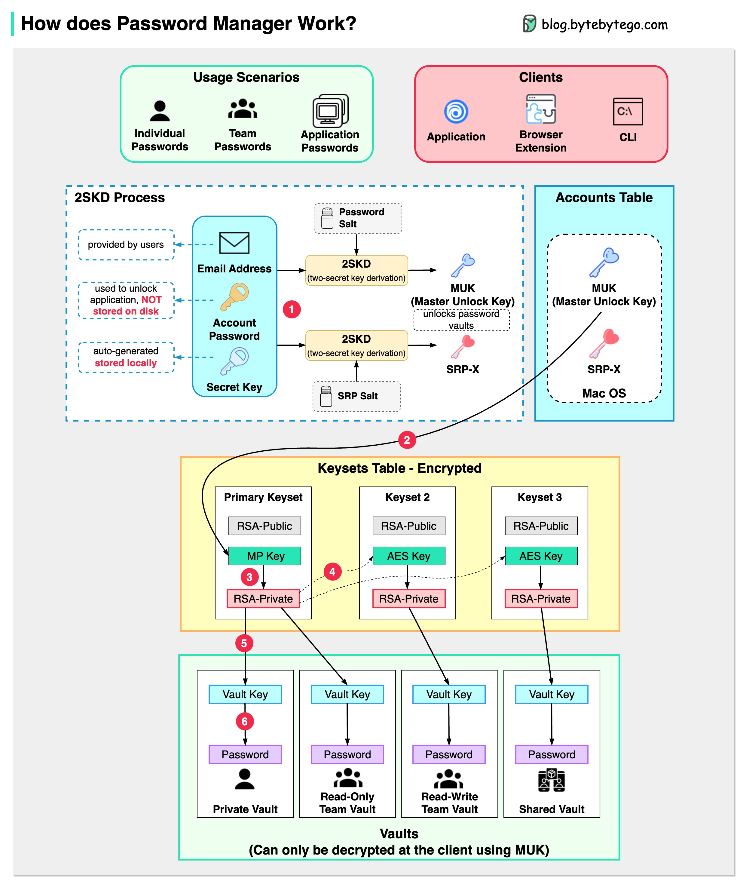

# 🔑 密码管理器是怎么工作的

> 你只需要记住一个密码，其他的交给它

密码管理器的工作原理，6步加密流程 👇

1️⃣ 注册时输入邮箱+账户密码，生成密钥。用2SKD算法生成MUK（主解锁密钥）。密钥只存本地，不发送到服务器

2️⃣ MUK生成主密钥集的加密MP密钥

3️⃣-5️⃣ MP密钥生成私钥 → 私钥生成AES密钥和保险库密钥

6️⃣ 保险库密钥加密保险库中的所有项目（密码、笔记等）

🔑 **核心安全设计**
密码管理器自己也无法知道你的加密密码。你只需记住一个账户密码，其余全部加密存储。

💡 用密码管理器比到处用同一个密码安全得多。推荐每个账户用不同的随机强密码。

---

#密码管理 #安全 #1Password #程序员 #技术干货 #隐私保护
