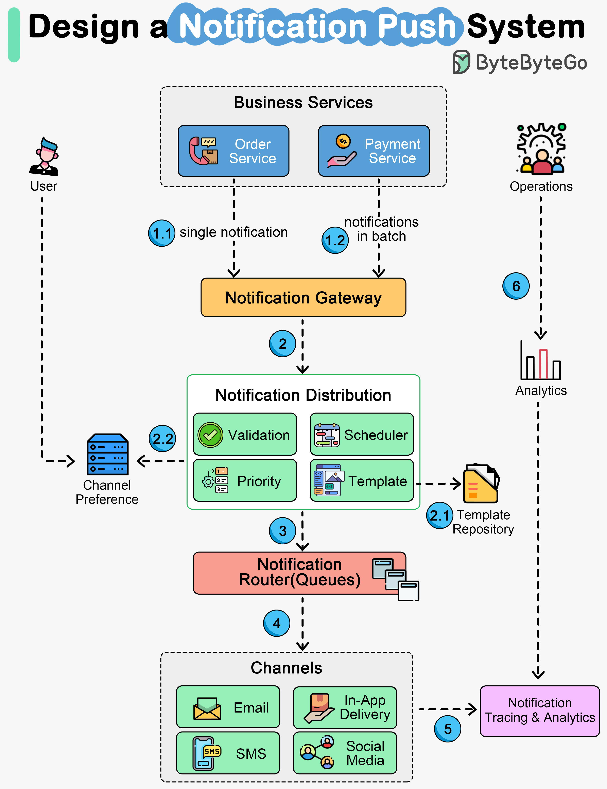

# 🔔 推送通知系统架构

> 一套系统搞定所有通知渠道

覆盖主要通知渠道的推送系统架构 👇

📌 **通知渠道**
- App内通知、邮件、短信/OTP、社交媒体推送

📌 **工作流程**
1. 业务服务发送通知到通知网关（支持单条和批量）
2. 分发服务验证、格式化、调度通知（支持模板和渠道偏好）
3. 通知发送到路由器（消息队列）
4. 渠道服务与各内外部投递渠道通信
5-6. 投递指标被追踪和分析，运营团队查看报告优化体验

💡 好的通知系统要支持：模板化、渠道偏好、批量发送、投递追踪、分析报告。

---

#推送通知 #系统设计 #后端开发 #程序员 #技术干货
