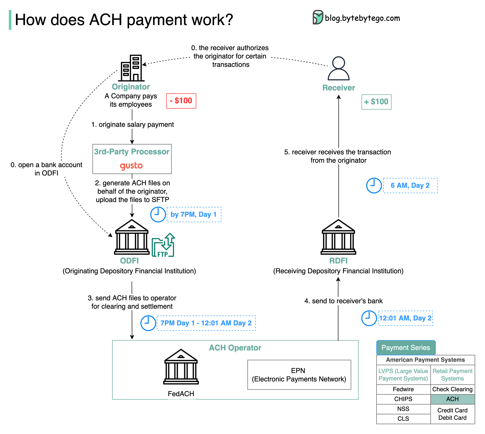

# 💵 ACH支付是怎么工作的

> 美国科技公司发工资用的就是ACH

ACH（自动清算所）处理美国零售交易，批量处理而非实时。以工资发放为例 👇

📌 **流程**
0. 发起方在商业银行（ODFI）开户，收款方授权
1. 公司发起工资支付，发送到第三方处理商（如Gusto）
2. 处理商生成ACH文件，7PM前上传到ODFI的SFTP
3. 晚间ODFI将ACH文件转发给ACH运营商（FedACH或EPN）清算
4. 午夜处理ACH文件，发送给收款银行（RDFI）
5. 次日早6AM，RDFI按指令操作收款人账户

📌 **关键信息**
- ACH是次日结算系统
- 2018年起支持同日ACH

💡 ACH是美国支付基础设施的核心，理解它对做跨境支付业务很重要。

---

#ACH #支付 #金融科技 #美国 #程序员 #技术干货
