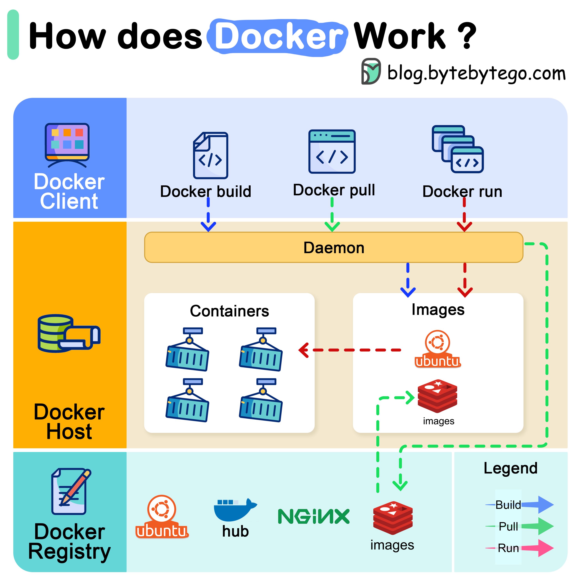

# 🐳 Docker是怎么工作的

> docker build、docker pull、docker run背后发生了什么

Docker架构的3个组件 👇

📌 **Docker客户端** — 与Docker守护进程通信

📌 **Docker主机** — 守护进程监听API请求，管理镜像、容器、网络、卷

📌 **Docker注册中心** — 存储Docker镜像（Docker Hub是公共注册中心）

📌 **docker run执行流程**
1. 从注册中心拉取镜像
2. 创建新容器
3. 分配读写文件系统
4. 创建网络接口连接默认网络
5. 启动容器

💡 Docker的核心价值：一次构建，到处运行。通过容器化消除"在我机器上能跑"的问题。

---

#Docker #容器化 #DevOps #程序员 #后端开发 #技术干货
