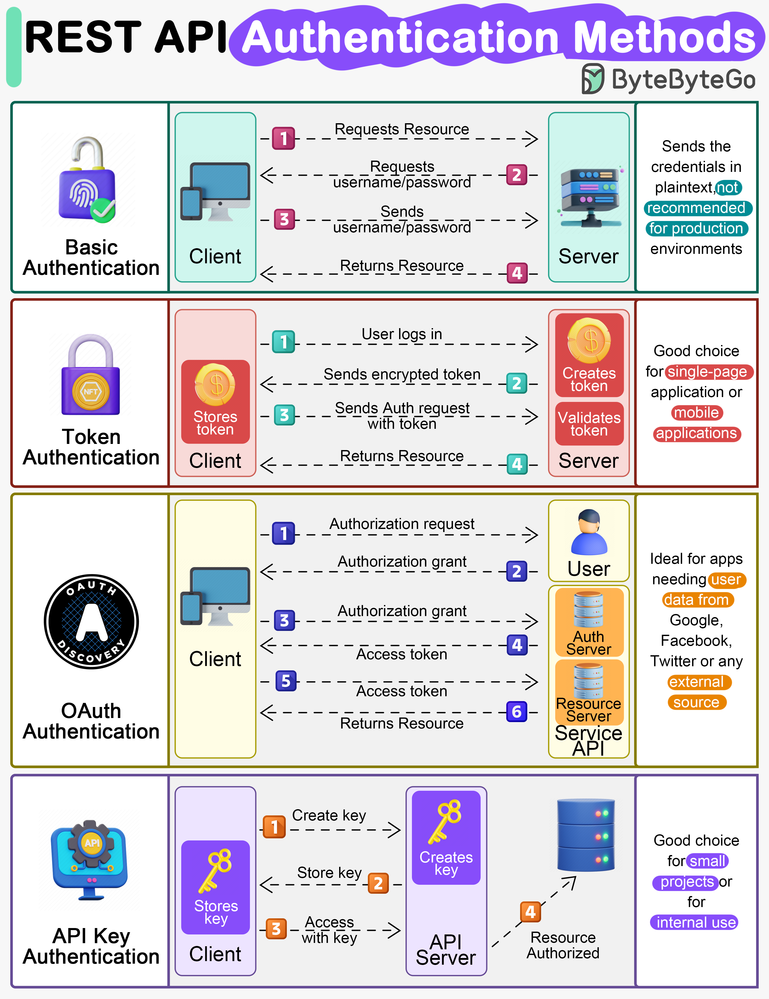

# 🔗 REST API是怎么工作的

> 最流行的API架构风格，一图速览

REST API的原则、方法、约束和最佳实践一图概览 👇

📌 核心原则：无状态、统一接口、客户端-服务器分离
📌 HTTP方法：GET、POST、PUT、PATCH、DELETE
📌 认证方式：API Key、OAuth、JWT

💡 REST的核心是"资源"的概念，每个URL代表一个资源，用HTTP方法操作资源。

---

#REST #API #后端开发 #程序员 #Web开发 #技术干货
