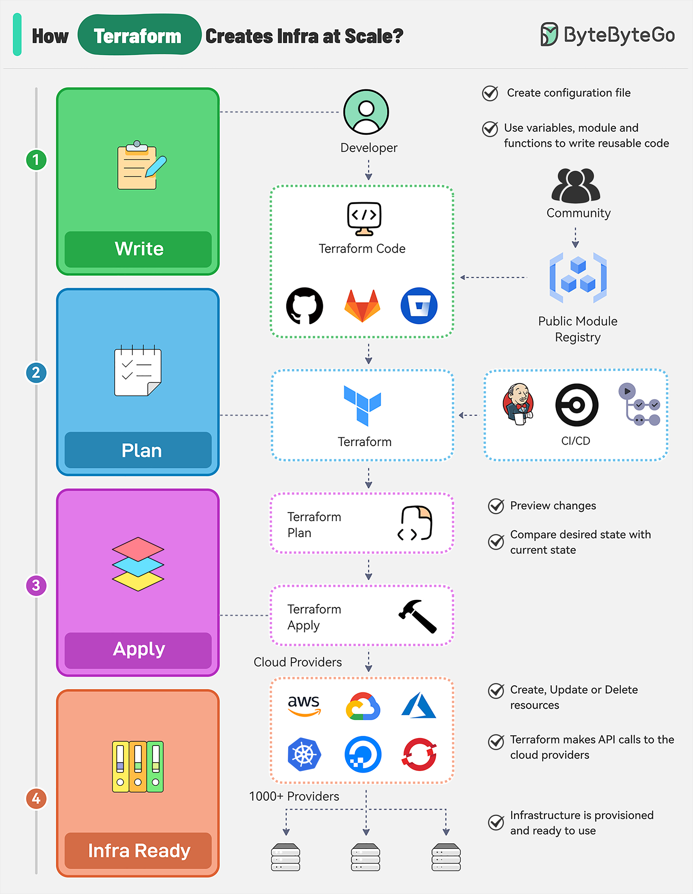

# 🏗️ Terraform如何把代码变成云

> Write → Plan → Apply → Ready，4步搞定

Terraform工作流的4个阶段 👇

1️⃣ **编写IaC** — 定义资源、提供商和配置，用变量和模块提高复用性

2️⃣ **terraform plan** — 预览变更，比较期望状态和当前状态

3️⃣ **terraform apply** — 创建/更新/删除资源，调用云提供商API（AWS/Azure/GCP/K8s），更新状态文件

4️⃣ **基础设施就绪** — 状态文件是基础设施当前状态的唯一真相源，支持版本控制和团队协作

💡 Terraform的核心价值：声明式描述你想要什么，而不是怎么做。状态文件是关键，要妥善管理。

---

#Terraform #IaC #DevOps #云计算 #程序员 #技术干货
