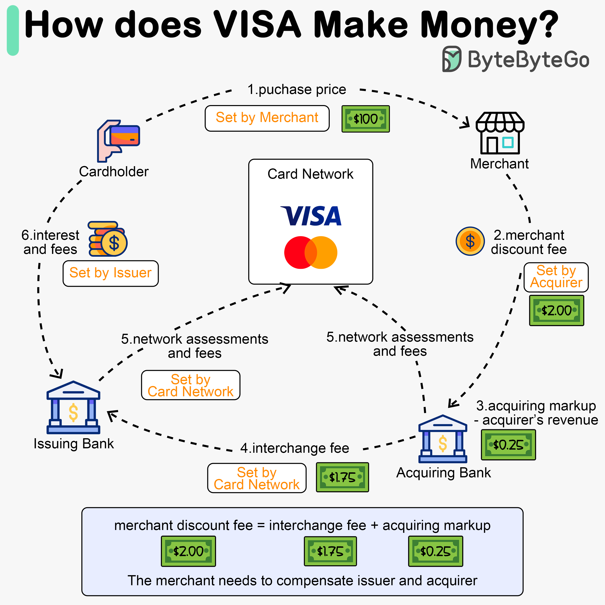

# 💳 VISA是怎么赚钱的

> 信用卡被称为"银行最赚钱的产品"，钱从哪来？

信用卡支付流程中的经济学 👇

📌 **支付流程**
1. 持卡人付$100给商家
2. 商家需要补偿发卡行和卡网络，支付"商户折扣费"
3-4. 收单行留$0.25（收单加价），$1.75付给发卡行（交换费）
5. 卡网络（VISA）向每家银行收取网络评估费（0.11%+$0.0195/笔）
6. 持卡人向发卡行支付服务费

📌 **为什么发卡行要被补偿？**
- 即使持卡人不还款，发卡行也要先付给商家
- 发卡行在持卡人还款前就先付了钱
- 还有账户管理、账单、风控、清算等运营成本

💡 VISA本身不承担信用风险，它只是网络中间人，收取服务费。这就是为什么VISA利润率极高。

---

#VISA #信用卡 #支付 #金融科技 #程序员 #技术干货
