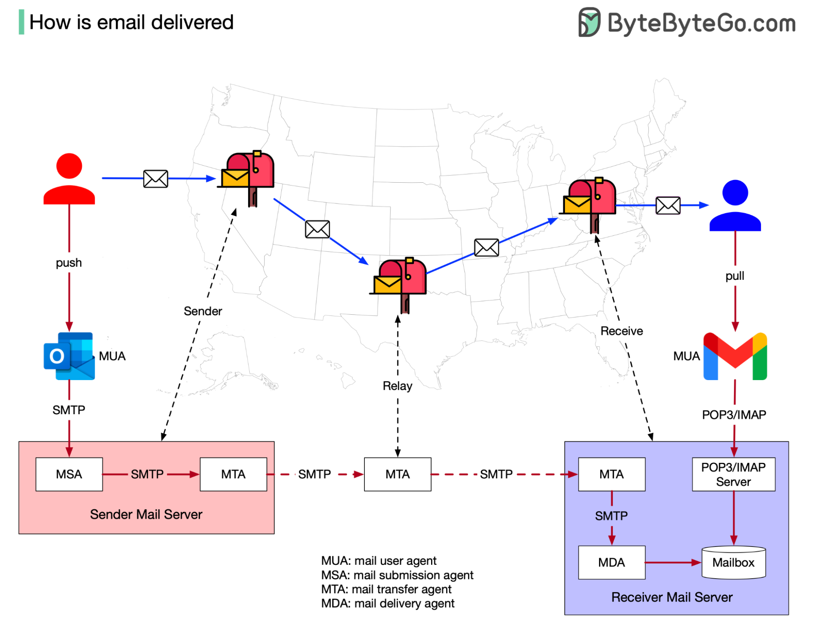

# 📧 邮件是怎么送达的

> 邮件系统和传统邮政系统惊人地相似

邮件投递和寄明信片的原理几乎一样 👇

📌 **传统邮政**
明信片→邮筒→邮局→目的地邮局→朋友的信箱

📌 **电子邮件**
- MUA（邮件用户代理）— 如Outlook/Gmail，相当于"邮筒"
- MTA（邮件传输代理）— 相当于"邮局"，用SMTP协议中继邮件
- MDA（邮件投递代理）— 将邮件存入收件箱
- 收件人用MUA通过POP3/IMAP协议取邮件

💡 邮件系统的核心协议：发送用SMTP，接收用POP3/IMAP。

---

#邮件 #SMTP #网络协议 #程序员 #技术干货
