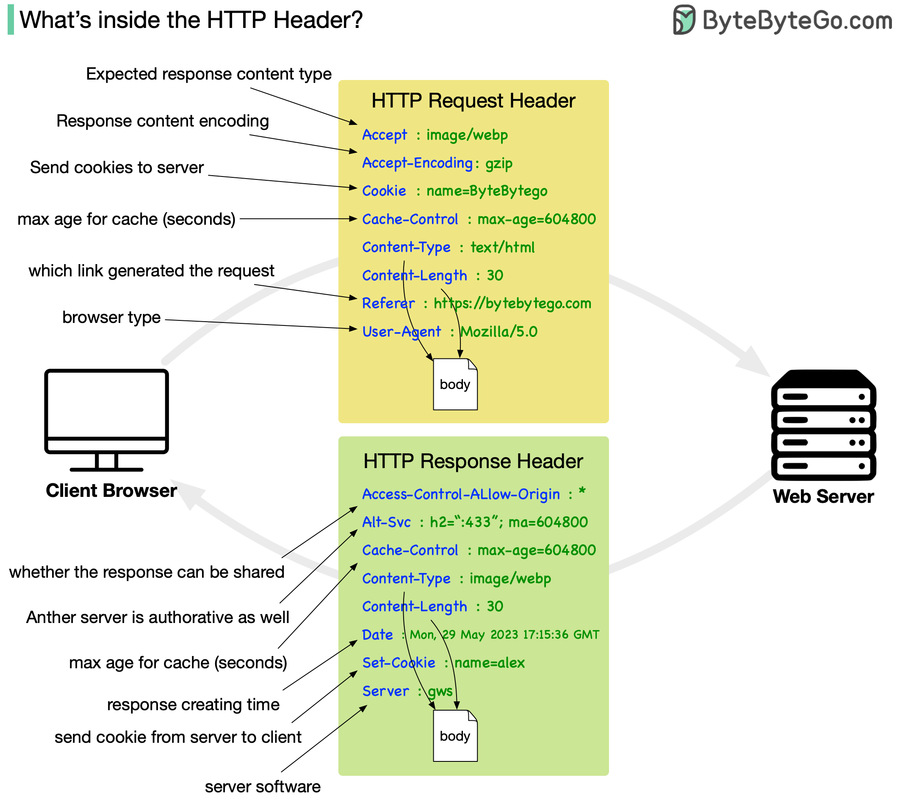

# 🌐 NAT如何让互联网持续增长

> 没有NAT，IPv4地址早就用完了

NAT（网络地址转换）让互联网的增长成为可能 👇

📌 **工作原理**
1. 多个设备共享一个路由器（一个公网IP）
2. 设备发送请求，包含私有IP
3. 路由器NAT将私有IP替换为公网IP
4. 请求发送到互联网
5. 响应回来时，NAT查记录，将公网IP替换回正确的私有IP

📌 **NAT的价值**
- 节省公网IP地址（否则IPv4早就耗尽）
- 多设备共享一个公网IP
- 充当基本防火墙，隐藏内部IP
- 简化大型网络管理

💡 NAT是IPv4时代的救星，但也带来了端到端连接的问题。IPv6的目标之一就是消除NAT的需要。

---

#NAT #网络 #IPv4 #计算机基础 #程序员 #技术干货
