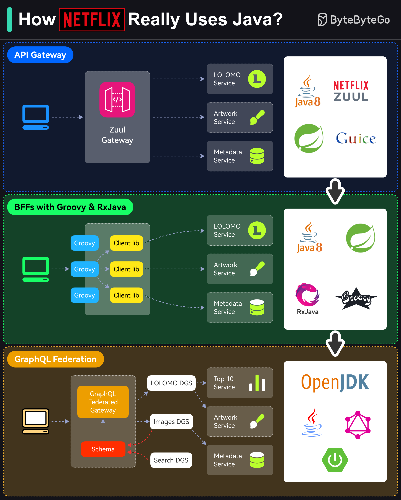

# ☕ Netflix是怎么用Java的

> Netflix的每个后端应用都是Java应用

Netflix是一个Java大厂，每个后端应用（内部工具、流媒体、电影制作）都用Java 👇

📌 **API网关** — 微服务架构，每个服务用Java（最初Java 8）

📌 **BFF + Groovy & RxJava** — 不同客户端（TV、手机、浏览器）需求不同，用BFF模式。Zuul变成代理角色

📌 **GraphQL联邦** — Groovy+RxJava方案让UI开发者负担太重，响应式编程也很难。迁移到GraphQL联邦

💡 Netflix的Java栈不是一成不变的，而是随着业务需求持续进化。

---

#Netflix #Java #微服务 #大厂案例 #程序员 #技术干货
