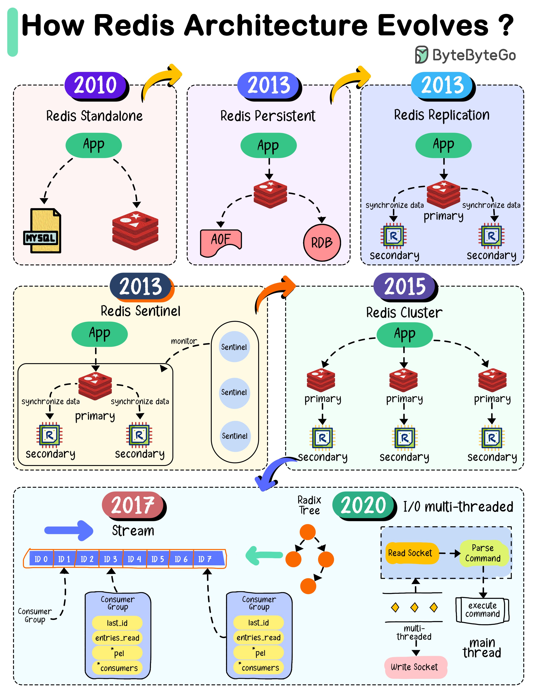

# 🔴 Redis架构进化史！从单机到集群

> 2010年到现在，Redis经历了5次重大进化

Redis架构的进化之路 👇

📌 **2010 单机Redis** — 简单缓存，重启数据丢失

📌 **2013 持久化** — RDB快照+AOF追加日志

📌 **2013 主从复制** — 主节点读写，从节点同步数据，提高可用性

📌 **2013 哨兵（Sentinel）** — 实时监控Redis实例，自动故障转移

📌 **2015 集群** — 数据分成16384个槽，分布到多个节点

📌 **2017** — Redis 5.0，新增Stream数据类型

📌 **2020** — Redis 6.0，网络模块引入多线程I/O

💡 Redis的进化路径：单机→持久化→复制→哨兵→集群→多线程。每一步都在解决上一步的瓶颈。

---

#Redis #缓存 #架构进化 #后端开发 #程序员 #技术干货
