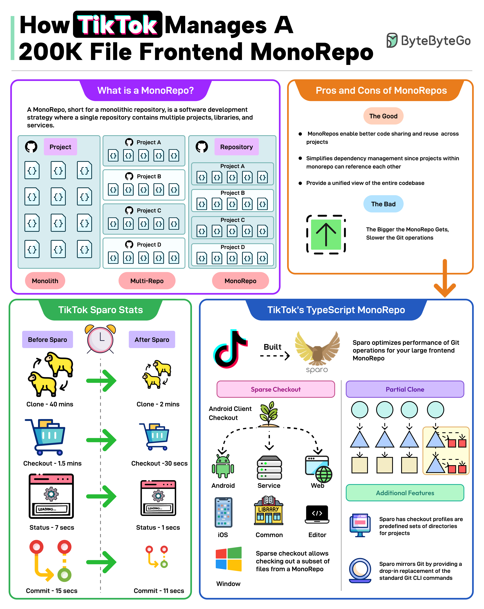

# 📱 TikTok如何管理20万文件的前端

> Git clone从40分钟降到2分钟

TikTok的前端TypeScript MonoRepo有20万文件，Git操作越来越慢。他们开发了Sparo工具 👇

📌 **MonoRepo的优点**
- 更好的代码共享
- 简化依赖管理
- 代码库统一视图

📌 **Sparo优化效果**
- Git clone：40分钟 → 2分钟
- Checkout：1.5分钟 → 30秒
- Status：7秒 → 1秒
- Commit：15秒 → 11秒

💡 MonoRepo规模大了之后Git性能是最大挑战。TikTok的Sparo是一个值得关注的解决方案。

---

#TikTok #MonoRepo #前端 #Git #大厂案例 #程序员 #技术干货
