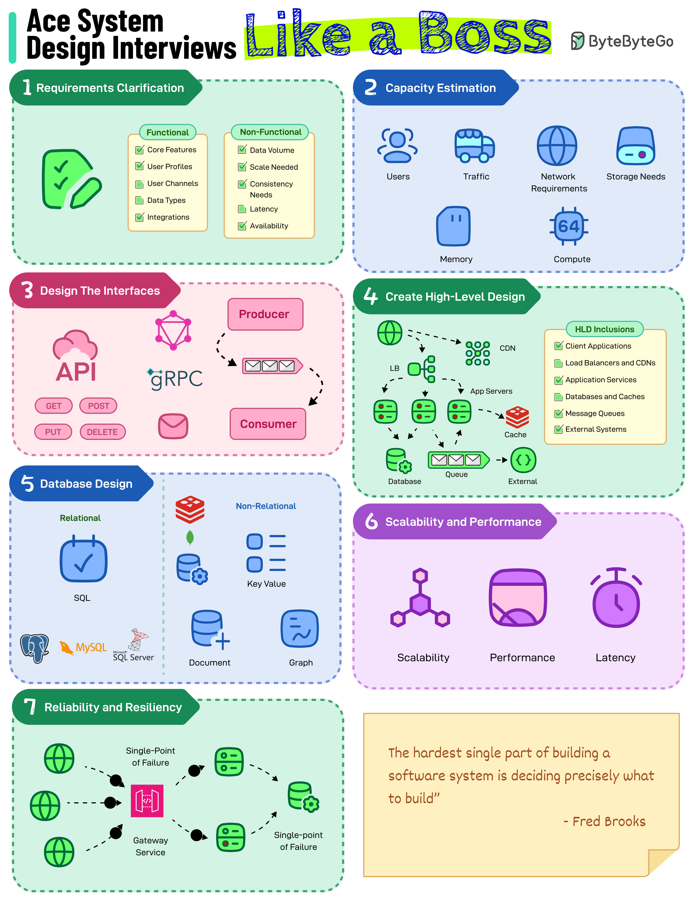

# 🎯 系统设计面试7步法！像老板一样通关

> 按这个流程走，系统设计面试不慌

系统设计面试的7步流程 👇

1️⃣ **需求澄清** — 明确功能和非功能需求（数据量、可用性、规模等）

2️⃣ **容量估算** — 估算用户数、流量、存储/内存、计算和网络需求

3️⃣ **高层设计** — 画出客户端、服务器、负载均衡、数据库等组件的框图，关注数据流

4️⃣ **数据库设计** — 数据建模，选择数据库类型，设计Schema

5️⃣ **接口设计** — 设计API端点或事件模型，选择通信方式（REST/GraphQL/gRPC）

6️⃣ **可扩展性和性能** — 缓存、索引、反范式化、分片、复制、CDN等

7️⃣ **可靠性和弹性** — 识别单点故障并缓解影响

💡 面试时按这7步展开，思路清晰，面试官会觉得你很有条理。

---

#系统设计 #面试 #程序员 #架构师 #技术干货 #职业发展
