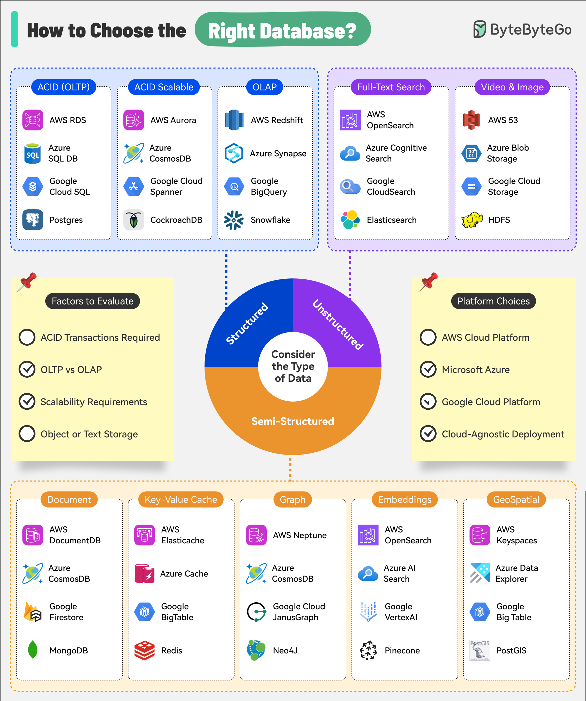

# 💾 如何选择正确的数据库

> 不同场景用不同数据库，一图搞定选型

8种数据库类型及其适用场景 👇

📌 **OLTP** — 事务系统，需要强一致性（MySQL、PostgreSQL）
📌 **OLAP** — 复杂查询和数据分析（ClickHouse、Redshift）
📌 **全文搜索** — 快速灵活的文本搜索（Elasticsearch）
📌 **文档存储** — JSON文档存储和查询（MongoDB）
📌 **键值存储** — 高速简单数据模型（Redis、DynamoDB）
📌 **图数据库** — 管理高度关联的数据（Neo4j）
📌 **向量数据库** — 向量表示的高效存储和检索（Pinecone、Milvus）
📌 **地理空间** — 位置相关数据和查询（PostGIS）

💡 先明确你的数据模型和查询模式，再选数据库。大多数场景从关系型数据库开始就对了。

---

#数据库 #选型 #MySQL #MongoDB #Redis #程序员 #技术干货
