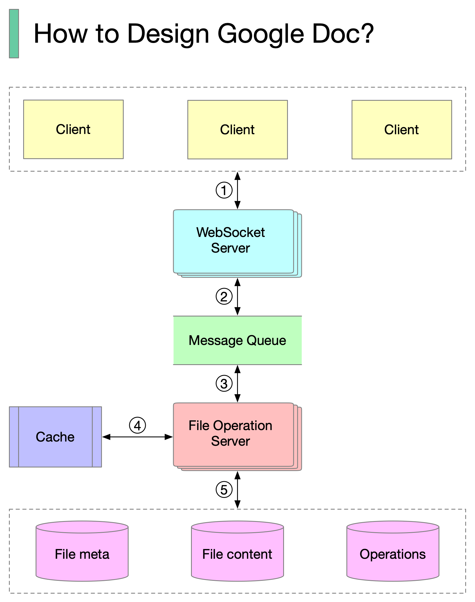

# 📝 设计Google Docs

> 多人同时编辑同一文档，冲突怎么解决？

Google Docs的简化架构 👇

📌 **核心组件**
1. 客户端发送编辑操作到WebSocket服务器
2. WebSocket处理实时通信
3. 操作持久化到消息队列
4. 文件操作服务器消费操作，用协作算法生成转换后的操作
5. 存储三类数据：文件元数据、文件内容、操作记录

📌 **实时冲突解决算法**
- OT（操作转换）— Google Docs在用
- DS（差异同步）
- CRDT（无冲突复制数据类型）— 活跃研究领域

💡 实时协作编辑的最大挑战是冲突解决。OT是成熟方案，CRDT是未来方向。

---

#GoogleDocs #实时协作 #系统设计 #面试 #程序员 #技术干货
