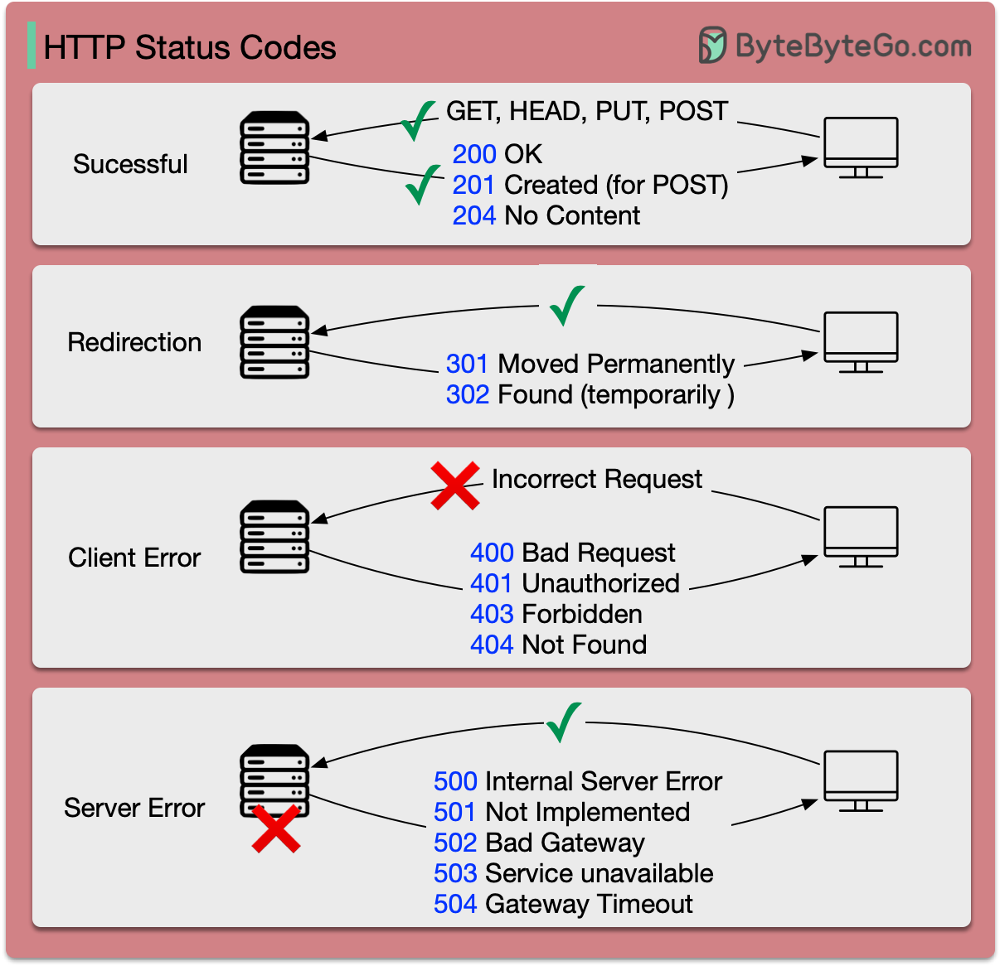

# 📊 HTTP状态码速查表

> 5大类状态码一图搞定，再也不用查文档了

每次接口报错看到一堆数字就头大？其实 HTTP 状态码就 **5大类**，记住规律就行 👇

📌 **1xx - 信息类（100-199）**
服务器说："收到了，继续发"，日常开发很少直接碰到

📌 **2xx - 成功（200-299）**
最想看到的！200 OK、201 Created、204 No Content 都是好消息 ✅

📌 **3xx - 重定向（300-399）**
资源搬家了！301 永久搬、302 临时搬、304 没变化用缓存

📌 **4xx - 客户端错误（400-499）**
你的锅！400 请求有误、401 没登录、403 没权限、404 找不到、429 请求太多

📌 **5xx - 服务端错误（500-599）**
服务器的锅！500 内部错误、502 网关挂了、503 服务不可用、504 超时

💡 **记忆技巧：**
- 2开头 = 开心
- 3开头 = 搬家
- 4开头 = 你的问题
- 5开头 = 服务器的问题

你遇到最多的状态码是哪个？我先说：502 😂

---

#HTTP #状态码 #后端开发 #API #Web开发 #程序员 #面试
