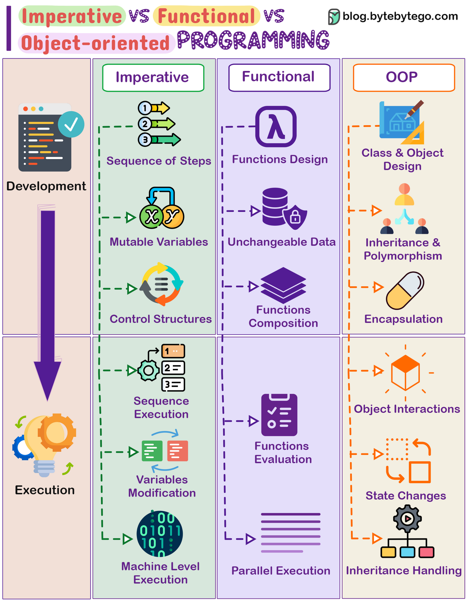

# 🧩 三大编程范式对比

> 一张图看懂三种编程思维的核心区别

写代码不只有一种方式，三大编程范式各有各的哲学 👇

📌 **命令式编程（Imperative）**
- 一步一步告诉计算机"怎么做"
- 用循环、条件语句控制流程
- 数据可变，强调执行步骤
- 代表语言：C、Python

📌 **函数式编程（Functional）**
- 用纯函数计算，不产生副作用
- 数据不可变，避免状态变化
- 支持高阶函数、递归、声明式写法
- 代表语言：Haskell、Scala、JS（部分特性）

📌 **面向对象编程（OOP）**
- 把现实世界抽象成对象，包含数据和方法
- 核心概念：继承、封装、多态
- 用类、对象、接口组织代码
- 代表语言：Java、C++、Python

💡 **怎么选？**
- 简单脚本 → 命令式
- 数据处理/并发 → 函数式
- 复杂业务系统 → 面向对象
- 实际项目中往往是混合使用

你更喜欢哪种范式？评论区说说 👇

---

#编程范式 #函数式编程 #面向对象 #编程 #软件开发 #程序员 #面试
