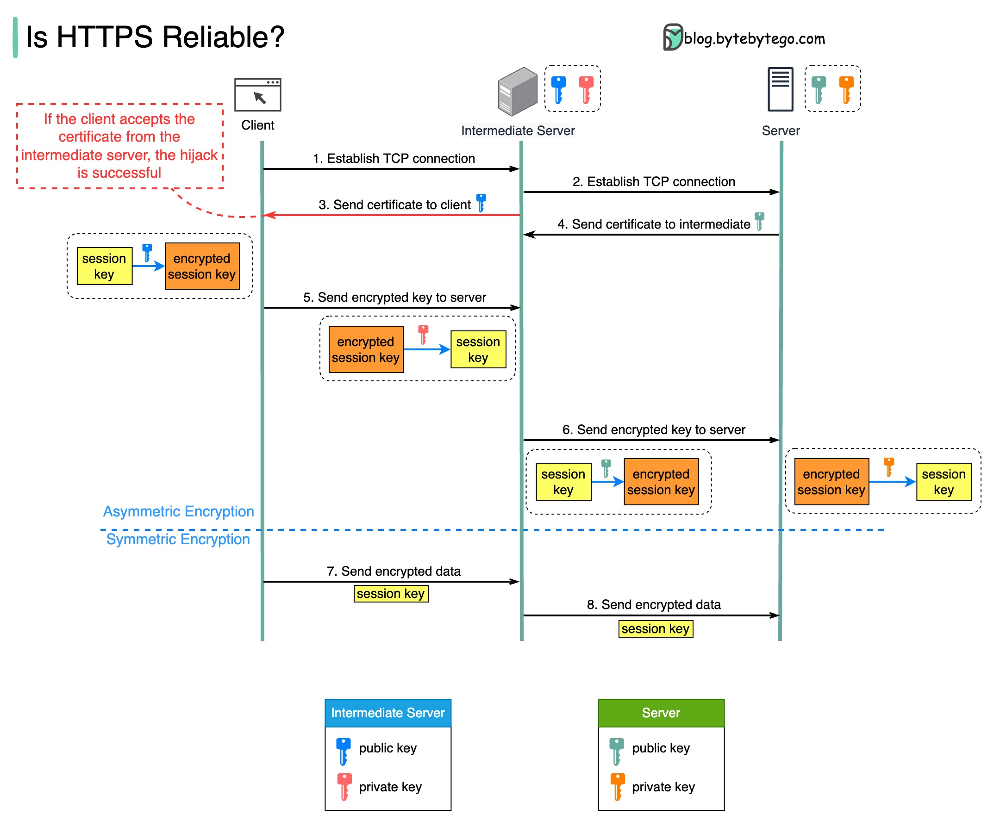

# 🔓 HTTPS真的安全吗

> 一张图揭秘中间人攻击的完整过程

都说HTTPS加密了很安全，那为什么 Fiddler、Charles 这些工具还能抓到HTTPS的包？🤔

关键在于 **中间人攻击（MITM）** 👇

📌 **前提条件**
中间人服务器的根证书已经被安装到你的信任列表中（这就是为什么抓包工具要你装证书）

📌 **攻击过程：**

1️⃣ 客户端发起TCP连接，但被中间人拦截，连接建立在中间人和客户端之间

2️⃣ 中间人再和真正的服务器建立TCP连接

3️⃣ 中间人把自己的SSL证书发给客户端，客户端验证通过（因为装了它的根证书）

4️⃣ 真正的服务器把证书发给中间人，中间人验证通过

5️⃣ 客户端用中间人的公钥加密会话密钥 → 中间人用私钥解密

6️⃣ 中间人再用真服务器的公钥加密会话密钥发过去

7️⃣ 两端都以为在安全通信，但中间人可以解密所有数据

💡 **所以HTTPS安全吗？**
- 正常情况下是安全的
- 但如果你信任了不该信任的证书，就会被中间人攻击
- 不要随便安装来路不明的证书！

你用过哪些抓包工具？👇

---

#HTTPS #网络安全 #中间人攻击 #抓包 #Fiddler #程序员 #安全
