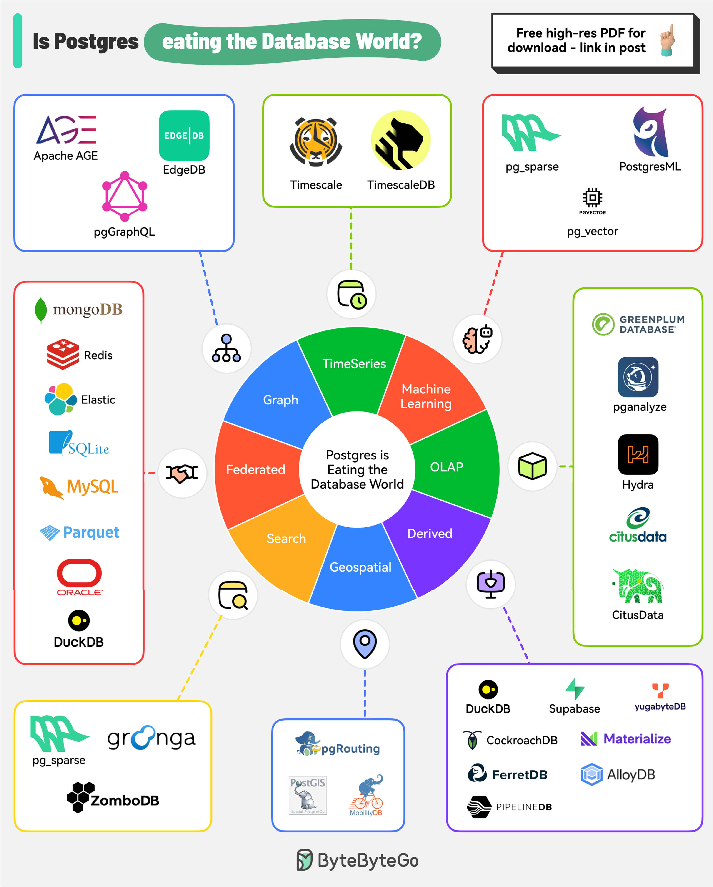

# 🐘 PostgreSQL正在吞噬数据库世

> 不知道选什么数据库？选PostgreSQL就对了

不管什么场景，PostgreSQL 好像都能搞定。来看看它到底有多全能 👇

📌 **时序数据** — Timescale 扩展，高效处理时间戳数据
📌 **机器学习** — pgVector + PostgresML，支持向量相似度搜索
📌 **OLAP分析** — Hydra、Citus、pg_analytics 加持
📌 **地理空间** — PostGIS 扩展，存储和查询地理数据
📌 **全文搜索** — pgroonga、ParadeDB、ZomboDB 提供搜索能力
📌 **图数据库** — Apache AGE、EdgeDB 基于PG构建
📌 **联邦查询** — 无缝对接 MongoDB、MySQL、Redis、Oracle 等数据源

📌 **衍生数据库更多：**
DuckDB、CockroachDB、AlloyDB、YugaByte、Supabase……全都基于或兼容 PostgreSQL

💡 **为什么PG这么强？**
- 开源免费，社区活跃
- 扩展机制强大，插件生态丰富
- SQL标准支持最完整
- 稳定可靠，大厂背书

选数据库纠结的时候，PostgreSQL 基本不会让你失望。

你在用 PostgreSQL 吗？最喜欢它的哪个特性？👇

---

#PostgreSQL #数据库 #后端 #系统设计 #开源 #程序员 #架构
