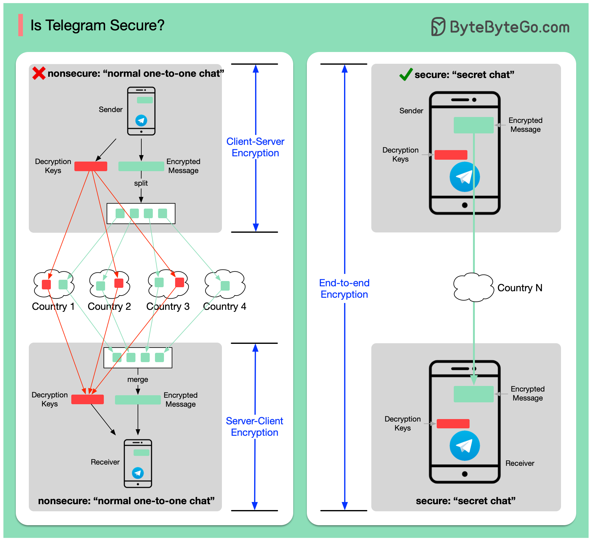

# 🔒 Telegram真的安全吗

> 普通聊天并没有端到端加密！

很多人觉得 Telegram 很安全，但事实是…… 👇

📌 **普通聊天 ≠ 端到端加密**
Telegram 的普通私聊和群聊 **没有** 端到端加密（E2EE），理论上第三方可以截获消息

📌 **那它怎么保护数据？**
- 加密消息存在 Telegram 服务器上，但被 **拆分成多块**，存在不同国家
- 解密密钥也被 **拆分存储** 在不同国家
- 黑客需要从所有地方拿到消息碎片和密钥才能解密，极其困难但并非不可能

📌 **秘密聊天才是真E2EE**
选择"秘密聊天"模式才有端到端加密，但有限制：
- ❌ 不支持群聊
- ❌ 只能在手机端使用
- ❌ 不支持普通一对一聊天模式

💡 **对比一下：**
- **Signal** — 默认所有聊天都是E2EE
- **WhatsApp** — 默认E2EE
- **Telegram** — 只有秘密聊天才是E2EE

所以如果你真的在意隐私，记得用秘密聊天模式。

你平时用什么聊天软件？觉得哪个最安全？👇

---

#Telegram #加密 #隐私 #安全 #端到端加密 #即时通讯 #科技
