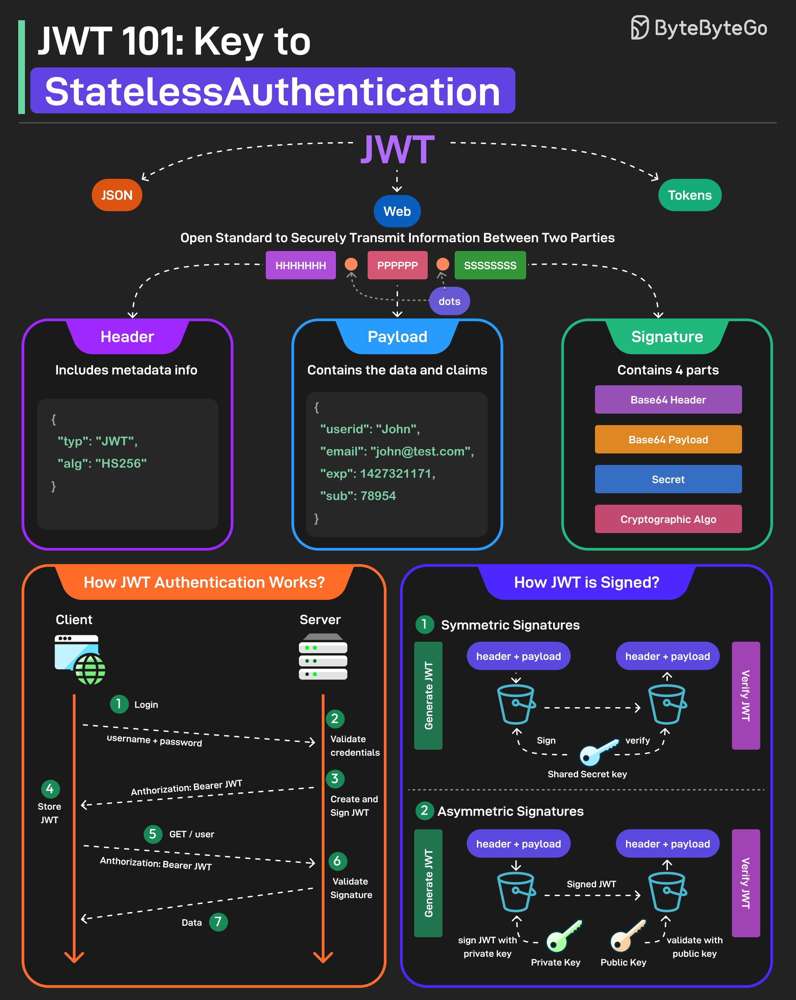

# 🎫 JWT入门！无状态认证的核心原理

> 一张图搞懂 JWT 的三大组成部分和签名机制

JWT（JSON Web Token）是目前最流行的认证方案之一，面试必问 👇

📌 **JWT 三大组成部分：**

1️⃣ **Header（头部）**
指定签名算法，JSON格式

2️⃣ **Payload（载荷）**
存放用户数据和声明（Claims），包括注册声明、公共声明、私有声明

3️⃣ **Signature（签名）**
用编码后的 Header + Payload + 密钥 + 算法生成，保证数据不被篡改

📌 **两种签名方式：**

🔹 **对称签名**
- 用同一个密钥签名和验证
- 签名方和验证方需要共享密钥
- 简单但密钥管理有风险

🔹 **非对称签名**
- 私钥签名，公钥验证
- 私钥只在服务端，公钥可以公开分发
- 更安全，适合分布式系统

💡 **JWT 的优势：**
- 无状态，服务端不用存 Session
- 自包含，Token 里就有用户信息
- 跨域友好，适合微服务架构

你的项目用 JWT 还是 Session？评论区聊聊 👇

---

#JWT #认证 #授权 #安全 #后端 #微服务 #面试 #程序员
