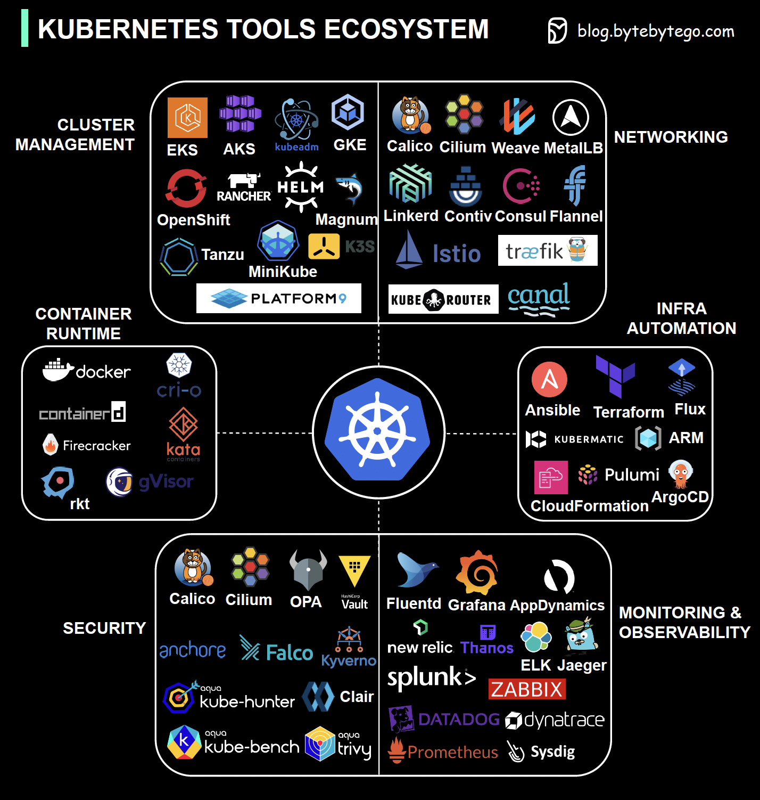

# 🛠️ K8s工具生态全景图

> 安全、网络、监控……K8s生态工具一图看完

Kubernetes 不只是一个编排平台，它背后有一整套工具生态 👇

📌 **安全（Security）** — 保护集群和应用安全
📌 **网络（Networking）** — 服务发现、流量管理
📌 **容器运行时（Container Runtime）** — 容器的底层引擎
📌 **集群管理（Cluster Management）** — 集群的创建和维护
📌 **监控与可观测性（Monitoring & Observability）** — 日志、指标、链路追踪
📌 **基础设施编排（Infrastructure Orchestration）** — 基础设施即代码

💡 K8s 从业者需要熟悉这些工具，才能确保容器化应用的可靠性、安全性和性能。

你最常用的 K8s 工具是哪些？👇

---

#Kubernetes #K8s #DevOps #云原生 #容器 #监控 #运维
