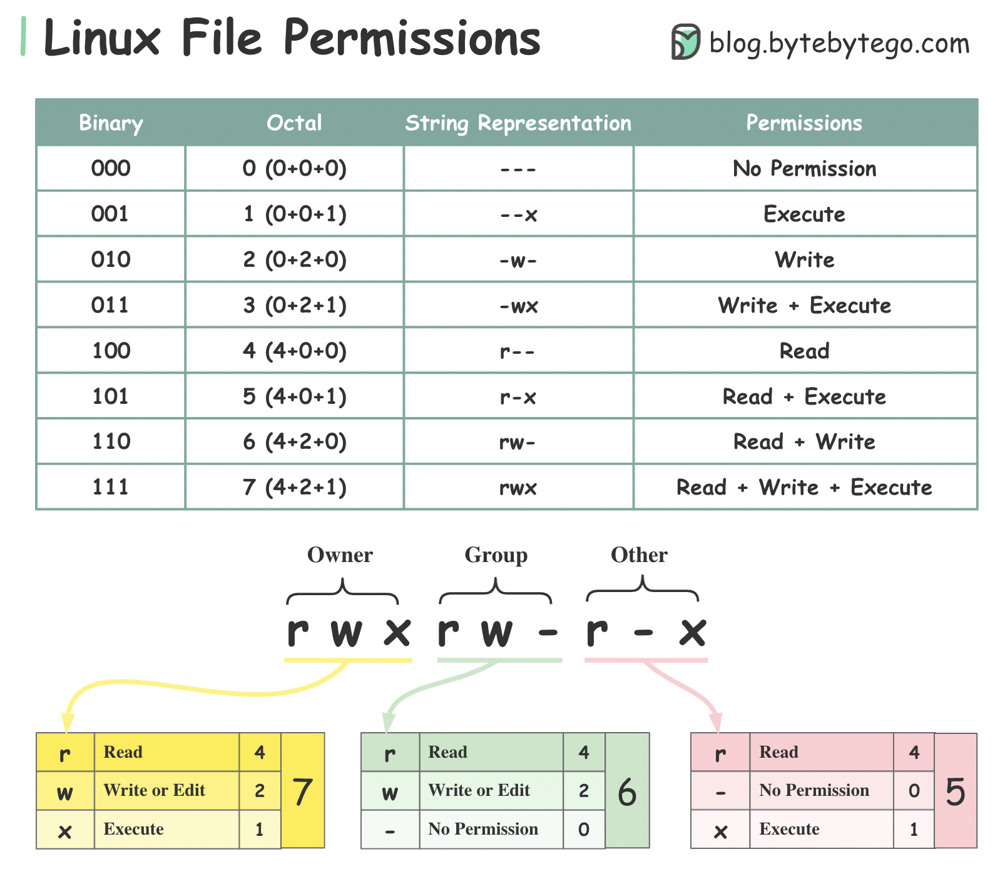

# 🔐 Linux文件权限一图看懂

> Owner、Group、Other + rwx，就这么简单

Linux 权限管理其实就两个维度：**谁** 和 **能干什么** 👇

📌 **三种所有者（Ownership）：**
- **Owner** — 创建文件的用户
- **Group** — 一组用户，组内成员权限相同
- **Other** — 既不是Owner也不在Group里的其他用户

📌 **三种权限（Permission）：**
- **r（读）** — 可以读取文件内容
- **w（写）** — 可以修改文件内容
- **x（执行）** — 可以执行文件

💡 **快速记忆：**
- `chmod 755` = rwxr-xr-x（Owner全部权限，其他人只读+执行）
- `chmod 644` = rw-r--r--（Owner读写，其他人只读）
- `chmod 777` = rwxrwxrwx（所有人全部权限，⚠️ 慎用）

权限设错了轻则功能异常，重则安全漏洞。每个 Linux 用户都该掌握这个基础知识。

你被权限问题坑过吗？👇

---

#Linux #文件权限 #chmod #运维 #后端 #程序员 #安全
