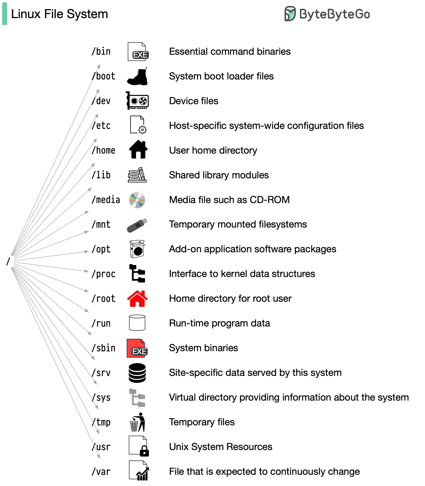

# 📁 Linux文件系统目录结构详解！

> 从根目录 / 开始，搞懂每个目录是干什么的

Linux 文件系统就像一棵树，从根目录 `/` 开始往下长 👇

📌 **为什么要有标准？**
1994年推出了 **FHS（文件系统层次标准）**，让不同 Linux 发行版的目录结构保持一致。虽然不是所有发行版都严格遵守，但大体框架是统一的。

📌 **常用目录速查：**
- `/bin` — 基本命令（ls、cp、mv）
- `/etc` — 系统配置文件
- `/home` — 用户主目录
- `/var` — 可变数据（日志、缓存）
- `/tmp` — 临时文件
- `/usr` — 用户程序和库
- `/opt` — 第三方软件
- `/dev` — 设备文件
- `/proc` — 进程信息（虚拟文件系统）

💡 **入门建议：**
用 `cd` 导航，用 `ls` 查看目录内容，从根目录开始探索。用多了自然就熟了。

你最常打交道的是哪个目录？👇

---

#Linux #文件系统 #运维 #后端 #程序员 #操作系统 #面试
