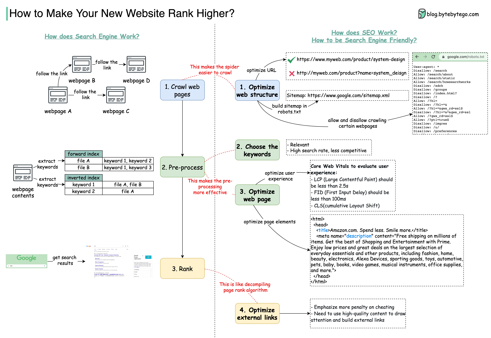

# 🔍 SEO搜索引擎优化入门

> 搜索引擎是怎么给网站排名的？怎么优化？

新网站上线了，怎么才能排到搜索结果前面？你需要了解 **SEO** 👇

📌 **搜索引擎工作三阶段：**
1. **爬虫** — 读取HTML内容，沿着超链接爬取更多页面
2. **预处理** — 去除HTML标签和停用词，建立正向/倒排索引，计算超链接关系
3. **排名** — 用户搜索时，根据索引和排名算法返回结果

📌 **优化网站结构：**
- 去掉爬虫无法读取的内容（Flash、Frame）
- 减少目录层级，让页面离首页更近
- URL要短、有描述性、包含关键词
- 使用HTTPS
- URL中不要用下划线

📌 **选择关键词：**
- 与业务相关
- 搜索量大但竞争少的词最有价值

📌 **优化页面内容：**
- 标题和描述包含关键词
- 正文包含相关关键词
- 注重用户体验（Google Core Web Vitals）

📌 **外部链接：**
- 被高权重网站引用能提升排名
- 发布高质量内容吸引外链

💡 SEO 是长期工程，不是一蹴而就的。但基础做好了，流量会持续增长。

你做过 SEO 优化吗？👇

---

#SEO #搜索引擎 #网站优化 #前端 #Web开发 #流量 #程序员
