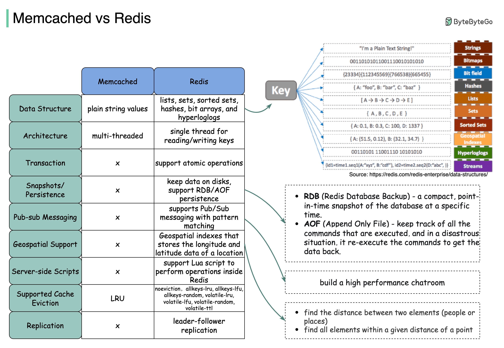

# ⚡ Memcached vs Redis

> 两大缓存之王到底怎么选？

面试经典问题：Redis 和 Memcached 有什么区别？👇

📌 **Redis 的优势在于丰富的数据结构：**
- **Hash** — 记录每篇帖子的点击数和评论数
- **ZSet** — 评论用户列表排序+去重
- **ZSet + Hash** — 缓存用户行为历史，过滤恶意行为
- **Bitmap** — 用极小空间存储海量布尔信息（登录状态、会员状态）

📌 **Memcached 的特点：**
- 纯内存KV存储，只支持简单的字符串
- 多线程架构，简单场景下性能不错
- 内存管理用 Slab 分配，碎片少

📌 **怎么选？**
- 需要丰富数据结构 → Redis
- 需要持久化 → Redis
- 需要发布订阅 → Redis
- 只需要简单KV缓存 → 都行
- 大多数场景下 → 选 Redis 就对了

💡 现在 Redis 基本已经成为缓存的事实标准，Memcached 的使用场景越来越少了。

你的项目用的哪个？👇

---

#Redis #Memcached #缓存 #面试 #后端 #系统设计 #程序员
