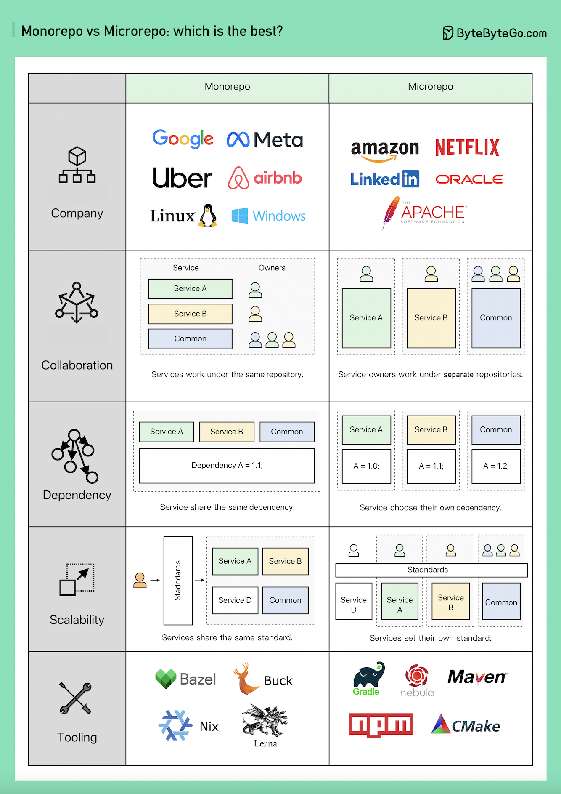

# 📦 Monorepo vs

> 为什么大厂的代码管理方式完全不同？

Google、Meta 把几乎所有代码放一个仓库，Amazon、Netflix 每个服务一个仓库。为什么？👇

📌 **Monorepo（单仓库）**
- Google、Meta、Uber、Airbnb 的选择
- 每个服务是一个文件夹，有独立的 BUILD 配置和权限控制
- 依赖全局共享，版本升级一次搞定
- 代码审查标准统一，质量有保障
- 工具：Google 的 Bazel、Meta 的 Buck

📌 **Microrepo（多仓库）**
- Amazon、Netflix 的选择
- 每个服务独立仓库，独立构建配置和权限
- 依赖各自管理，按自己节奏升级
- 业务扩展更快，但代码质量可能参差不齐
- 工具：Maven、Gradle、NPM、CMake

📌 **怎么选？**
- 追求一致性和代码质量 → Monorepo
- 追求团队自治和快速迭代 → Microrepo
- 团队规模小 → Monorepo 更简单
- 团队规模大且分散 → Microrepo 更灵活

💡 没有绝对的好坏，关键看团队规模、协作模式和技术栈。

你们公司用的哪种？👇

---

#Monorepo #代码管理 #Git #架构 #微服务 #DevOps #程序员
