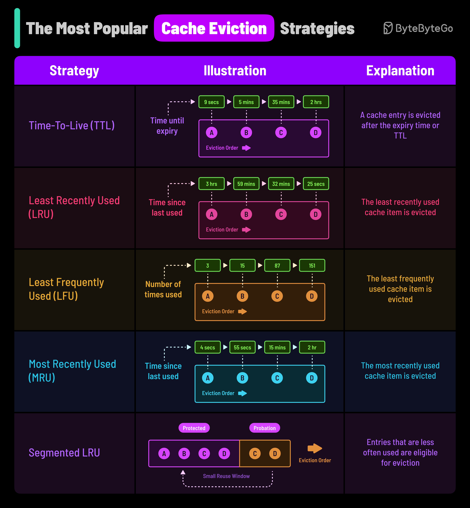

# 🗑️ 5种缓存淘汰策略！缓存满了怎么办？

> TTL、LRU、LFU……选对策略性能翻倍

缓存空间有限，满了就得淘汰一些数据。选哪种策略？👇

📌 **TTL（过期时间）**
到时间就淘汰，不管访问频率。简单粗暴，适合有时效性的数据（如Session）

📌 **LRU（最近最少使用）**
最久没被访问的先淘汰。适合有时间局部性的场景——最近用过的大概率还会再用

📌 **LFU（最不经常使用）**
访问次数最少的先淘汰。适合有些数据明显比其他数据更热门的场景。需要维护访问计数

📌 **MRU（最近最多使用）**
最近刚访问的先淘汰。听起来反直觉，但在操作系统缓冲区、流处理等场景很有用

📌 **SLRU（分段LRU）**
缓存分为试用区和保护区，新数据进试用区，频繁访问的晋升到保护区，避免被过早淘汰

💡 **怎么选？**
- 大多数场景 → LRU（最通用）
- 有明显热点数据 → LFU
- 有时效要求 → TTL
- 不确定 → LRU + TTL 组合

你用过哪种淘汰策略？👇

---

#缓存 #LRU #Redis #系统设计 #后端 #性能优化 #面试
