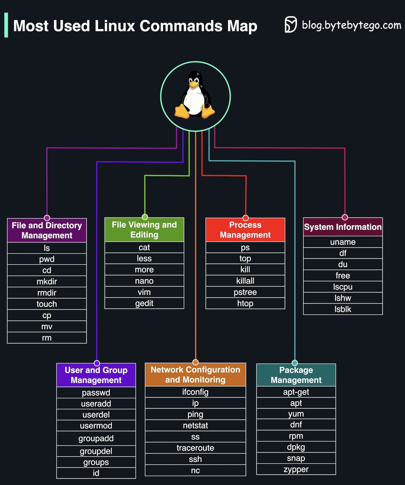

# 🗺️ 最常用Linux命令地图

> 收藏这张图，Linux命令不再迷路

Linux 命令太多记不住？这张地图按功能分类帮你整理好了 👇

📌 **文件和目录管理** — ls、cd、cp、mv、rm、mkdir、find
📌 **文件查看和编辑** — cat、less、head、tail、vim、nano
📌 **进程管理** — ps、top、kill、htop、bg、fg
📌 **系统信息** — uname、df、du、free、uptime
📌 **用户和组管理** — useradd、usermod、passwd、chmod、chown
📌 **网络配置和监控** — ifconfig、ping、netstat、curl、wget、ssh
📌 **包管理** — apt、yum、dnf、brew

💡 不用全背，常用的记住就行。用多了自然就熟了。建议收藏这张图，忘了就翻出来看。

你最常用的 Linux 命令是哪个？我先说：`grep` 👇

---

#Linux #命令行 #运维 #后端 #程序员 #效率 #DevOps
