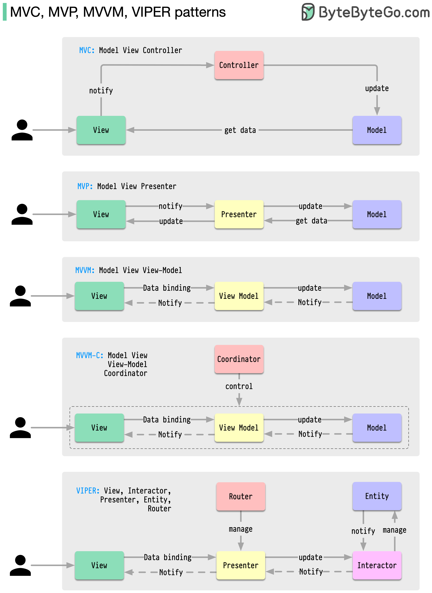

# 🏛️ MVC vs MVP vs

> 客户端架构模式到底有什么区别？

做 iOS/Android 开发一定会遇到这些架构模式，它们到底有什么区别？👇

📌 **共同点：**
- 都有 **View（视图）** 负责展示和接收用户输入
- 大多有 **Model（模型）** 管理业务数据
- 中间层（Controller/Presenter/ViewModel）负责协调 View 和 Model

📌 **MVC** — 最古老，快50年了
📌 **MVP** — Presenter 完全接管 View 的逻辑
📌 **MVVM** — 数据绑定，View 自动响应数据变化
📌 **VIPER** — 最细粒度的拆分，职责最清晰

💡 每种模式都是为了解决上一种的痛点。中间层越来越复杂，所以才不断演进出新模式让代码更好维护。

你的项目用的哪种架构模式？👇

---

#架构模式 #MVC #MVVM #iOS #Android #软件设计 #程序员
