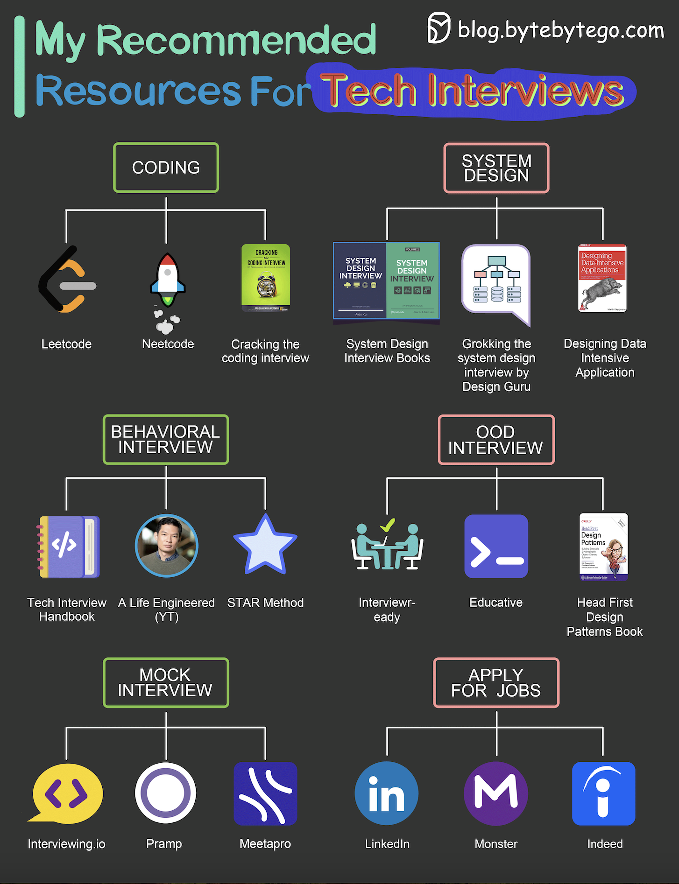

# 📚 技术面试备战资料大全

> 按类别整理，照着准备就对了

准备技术面试不知道从哪开始？按这个清单来 👇

📌 **算法刷题**
- LeetCode — 刷题主战场
- 《Cracking the Coding Interview》— 经典面试书
- Neetcode — 精选题目+视频讲解

📌 **系统设计**
- 《System Design Interview》Vol.1 & 2 — Alex Xu 的神书
- Grokking the System Design — Design Guru 出品
- 《DDIA》— 数据密集型应用设计

📌 **行为面试**
- Tech Interview Handbook（GitHub）
- A Life Engineered（YouTube）
- STAR 方法 — 万能回答框架

📌 **面向对象设计**
- Interviewready
- OOD by Educative
- 《Head First Design Patterns》

📌 **模拟面试**
- Interviewing.io / Pramp / Meetapro

📌 **投简历**
- LinkedIn / Monster / Indeed

💡 不用全部都看，每个类别选1-2个深入准备就够了。关键是坚持练习。

你面试准备用的什么资料？👇

---

#面试 #技术面试 #LeetCode #系统设计 #程序员 #求职 #刷题
