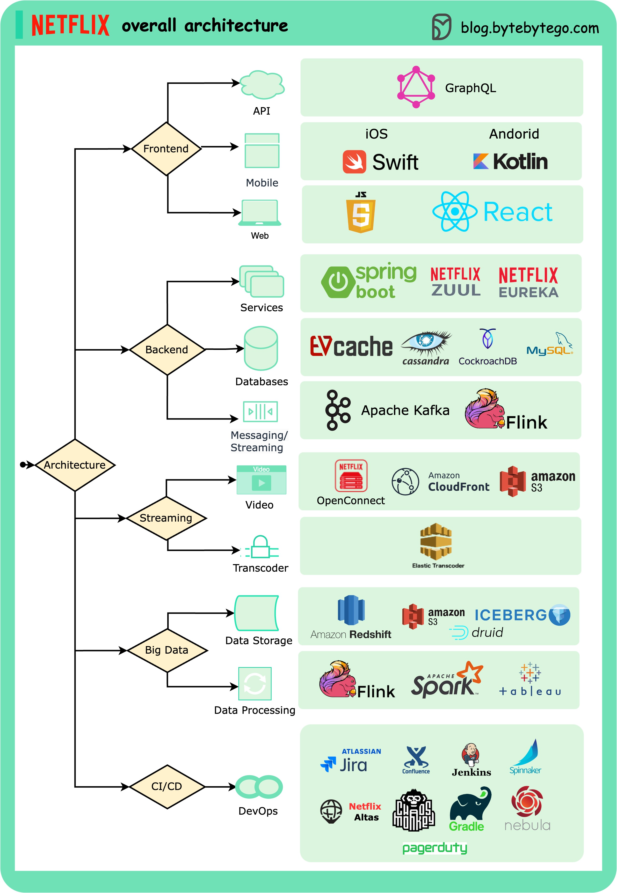

# 🎬 Netflix整体架构全景图

> 全球最大流媒体平台的技术架构拆解

Netflix 的架构到底长什么样？从前端到后端全拆解 👇

📌 **前端** — Swift（iOS）、Kotlin（Android）、React（Web）
📌 **前后端通信** — GraphQL
📌 **后端服务** — ZUUL（网关）、Eureka（服务发现）、Spring Boot
📌 **数据库** — EVCache、Cassandra、CockroachDB
📌 **消息流** — Apache Kafka + Flink
📌 **视频存储** — S3 + Open Connect（自建CDN）
📌 **数据处理** — Flink + Spark 处理，Tableau 可视化，Redshift 数据仓库
📌 **CI/CD** — JIRA、Jenkins、Gradle、Chaos Monkey、Spinnaker、Atlas

💡 Netflix 的架构特点：大量自研+开源、微服务架构、混沌工程文化、自建CDN。

你最感兴趣的是哪个部分？👇

---

#Netflix #架构 #微服务 #系统设计 #后端 #GraphQL #Kafka
