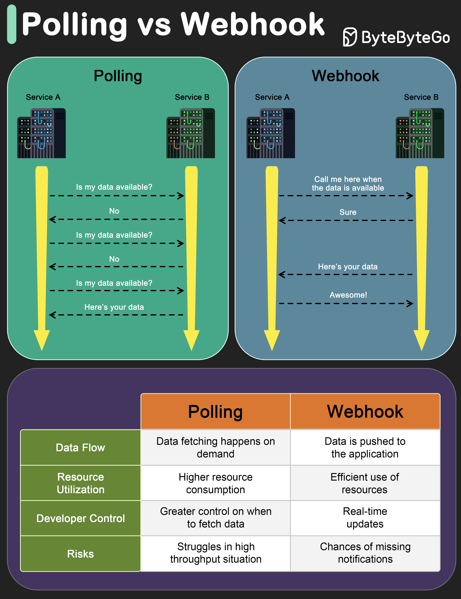

# 🔔 轮询 vs Webhook

> 一个是你主动问，一个是别人主动告诉你

获取外部服务的数据更新，两种方式 👇

📌 **轮询（Polling）**
- 定时去问："有新数据吗？有新数据吗？"
- 即使没有更新也在不停地问
- 资源消耗大，效率低
- 不是实时的，只有问的时候才知道
- 但开发者对数据获取有更多控制权

📌 **Webhook**
- 像一个通知系统
- 你提供一个回调地址给外部服务
- 有新数据时，外部服务主动推送给你
- 实时性强，资源利用高效

📌 **怎么选？**
- 需要实时更新 → **Webhook**
- 高吞吐环境 → **Webhook** 更省资源
- 基础设施限制无法用 Webhook → **轮询**
- 担心通知丢失 → 轮询更可控（Webhook 需要重试机制）

💡 现代系统大多优先用 Webhook，轮询作为兜底方案。

你的项目用的哪种方式？👇

---

#Webhook #轮询 #API #后端 #系统设计 #实时 #程序员
