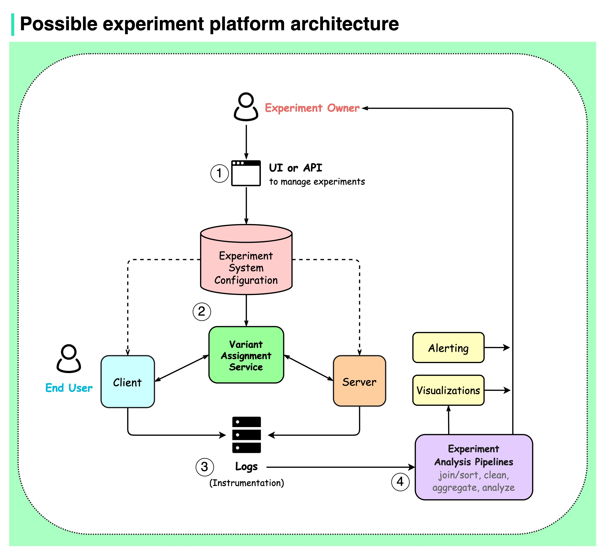

# 🧪 A/B测试实验平台架构长什么样？

> 4大核心组件，搭建你自己的实验平台

想做数据驱动决策？你需要一个实验平台。来看看它的架构 👇

📌 **4大核心组件：**

1️⃣ **实验定义与管理（UI）**
通过界面创建、配置和管理实验，存储在实验系统配置中

2️⃣ **实验部署**
将实验部署到服务端和客户端，包括变体分配和参数化

3️⃣ **实验埋点**
收集实验相关的数据和指标

4️⃣ **实验分析**
分析实验结果，判断哪个变体更优

💡 好的实验平台是数据驱动文化的基础。Google、Netflix、字节跳动都有自己的实验平台，这也是为什么它们的产品迭代这么快。

你们公司有实验平台吗？👇

---

#AB测试 #实验平台 #数据驱动 #产品 #后端 #架构 #增长
