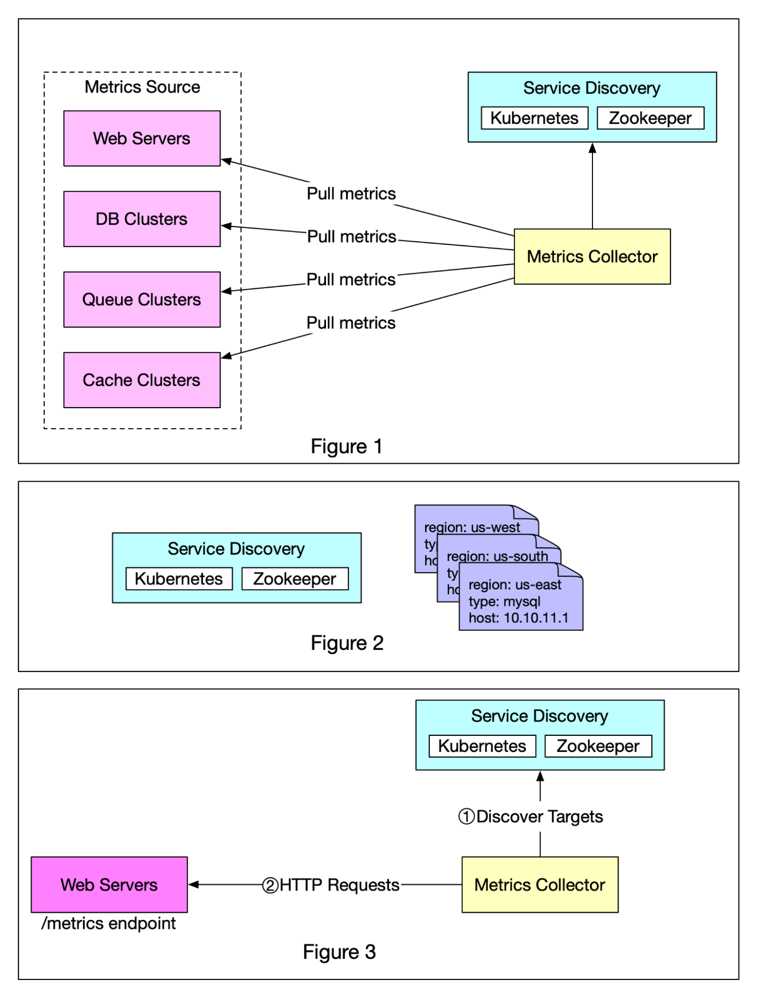

# 📊 监控指标采集：Push还是Pull？

> 两种模式各有优劣，看完就知道怎么选

监控系统采集指标数据，到底该用 Push 还是 Pull？👇

📌 **Pull 模式（拉取）**
- 指标采集器定期从应用拉取数据
- 需要知道所有服务端点的地址
- 通过 **服务发现**（K8s、Zookeeper）自动获取端点列表
- 服务端点变化时自动通知采集器
- 代表：**Prometheus**

📌 **Pull 模式详细流程：**
1. 采集器从服务发现获取端点元数据（拉取间隔、IP、超时参数等）
2. 通过预定义的 HTTP 端点（如 `/metrics`）拉取数据
3. 可选：注册变更通知，端点变化时自动更新

📌 **Push 模式（推送）**
- 应用主动把指标推送到采集器
- 不需要服务发现
- 适合短生命周期的任务（如批处理）

💡 **怎么选？**
- 长期运行的服务 → Pull（Prometheus）
- 短生命周期任务 → Push
- 大规模集群 → Pull + 服务发现更好管理

你们的监控用的 Push 还是 Pull？👇

---

#监控 #Prometheus #DevOps #可观测性 #后端 #运维 #系统设计
