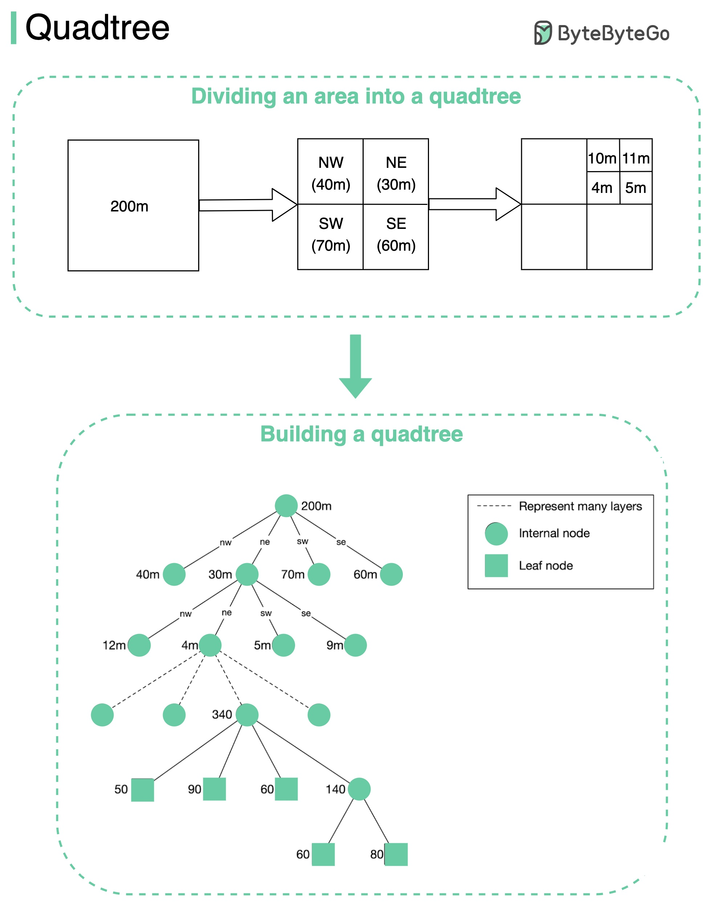

# 🌳 四叉树！"附近的人"背后的数据结构

> 递归分割二维空间，高效查找附近位置

除了 Geohash，还有一种更灵活的空间索引结构——**四叉树（Quadtree）** 👇

📌 **什么是四叉树？**
递归地把二维空间分成4个象限，直到每个格子里的数据量满足条件（比如不超过100个商家）

📌 **关键特点：**
- 是 **内存数据结构**，不是数据库方案
- 运行在每台 LBS 服务器上
- 服务启动时构建

📌 **怎么查找附近商家？**
1. 在内存中构建四叉树
2. 从根节点开始遍历，找到搜索点所在的叶子节点
3. 如果叶子节点有100个商家，直接返回
4. 否则从邻居节点补充，直到数量足够

📌 **更新和重建：**
- 2亿商家构建四叉树可能需要几分钟
- 构建期间服务器无法处理请求
- 所以要 **增量发布**，每次只更新一小部分服务器

💡 四叉树比 Geohash 更灵活，能自适应数据密度。市中心格子小，郊区格子大。

你对空间索引感兴趣吗？👇

---

#四叉树 #数据结构 #算法 #位置服务 #系统设计 #后端 #面试
