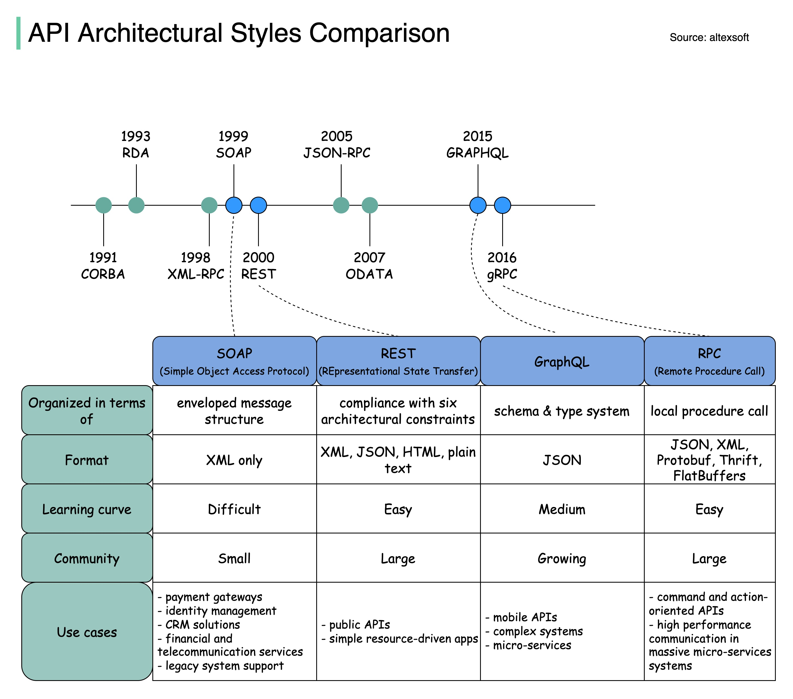

# 🔀 SOAP vs REST vs

> API架构风格的演进时间线和使用场景

API 架构风格经历了多次演进，每种都有自己的数据交换标准 👇

📌 **SOAP** — 最早的Web服务标准，XML格式，严格规范，企业级应用常用
📌 **REST** — 基于HTTP，资源导向，简单灵活，目前最主流
📌 **GraphQL** — 单端点，客户端按需查询，前端友好
📌 **RPC（gRPC）** — 远程过程调用，高性能，适合微服务间通信

💡 没有最好的API风格，只有最适合场景的。了解每种的优劣势，才能做出正确选择。

你的项目用的哪种API风格？👇

---

#API #REST #GraphQL #gRPC #SOAP #后端 #系统设计 #面试
